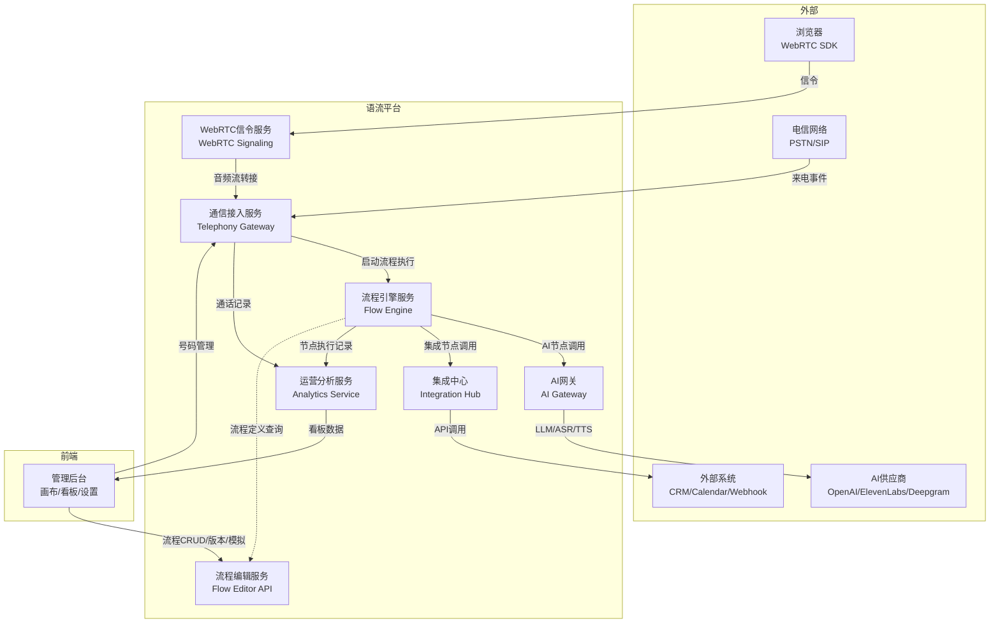
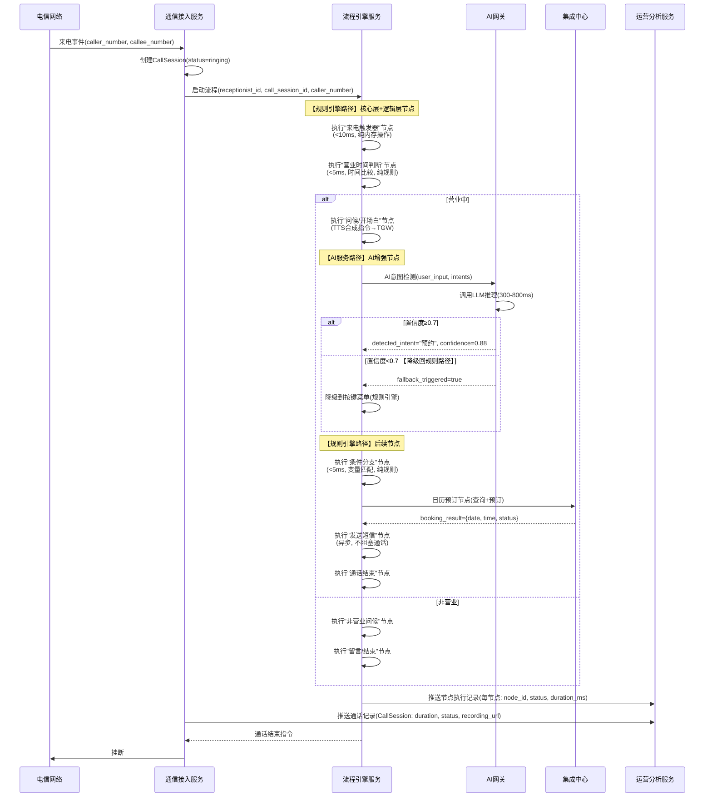
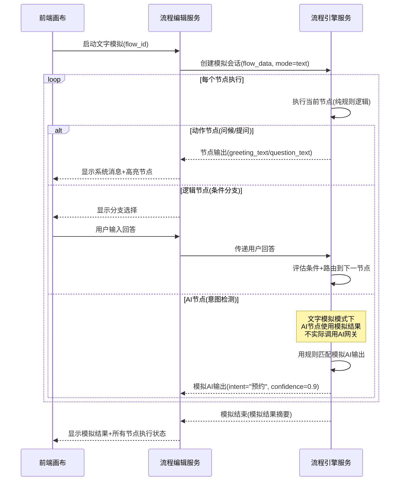
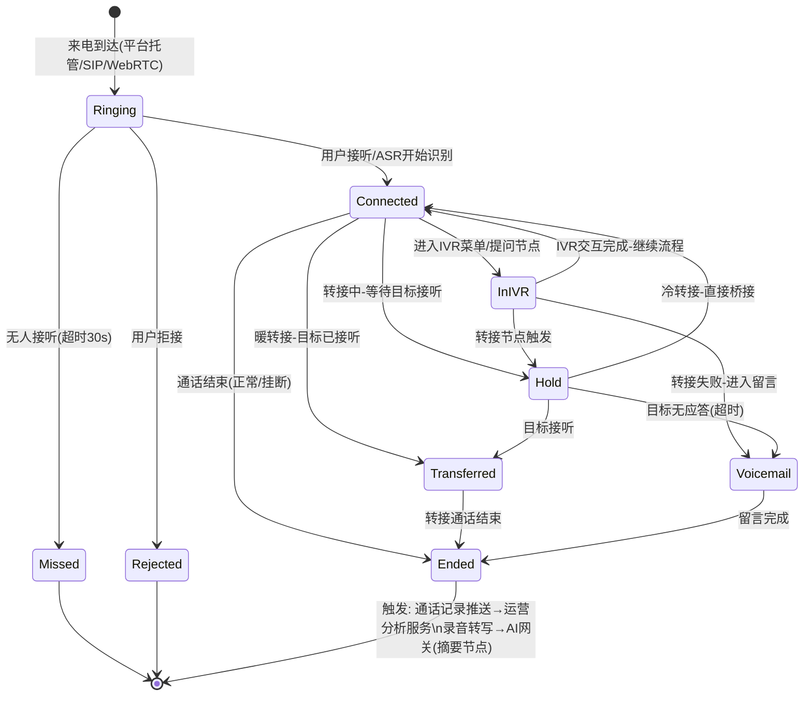
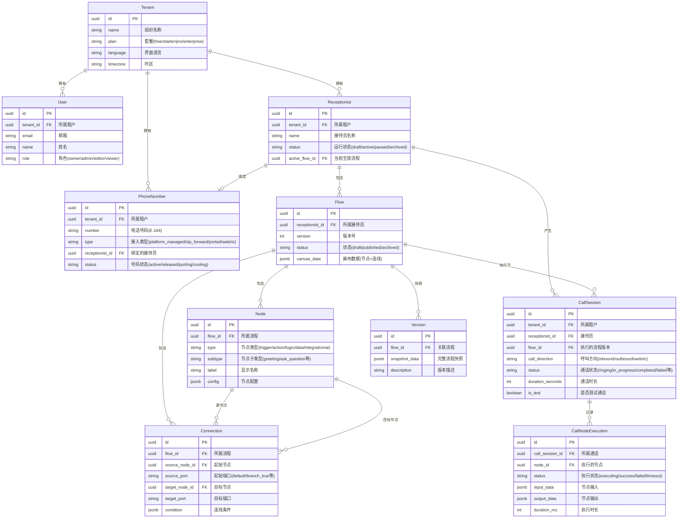
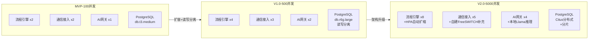

# 语流(VoiceFlow Builder) — 产品技术架构文档

> 版本：v1.0 | 日期：2026-05-03

## 定位说明

本文档是语流产品技术输出的中间层，承上启下：

- **总图四（技术架构全景图）** 是一页概览，回答"系统有几层、每层大概做什么"——是架构的索引。
- **本文档（产品技术架构文档）** 是总图四的完整展开，回答"系统怎么分解、服务怎么协作、数据怎么流转、关键技术方向怎么选型"——是架构的蓝图。产品总监用它把控技术方向，技术负责人用它指导系统设计。
- **产品技术对接规格** 是本文档的实现约束层，回答"每个实体的字段是什么、每个API的入参出参是什么"——是编码的输入。

三层关系：**总图四（一页概览）→ 本文档（架构蓝图）→ 对接规格（实现约束）**。三个文档描述的是同一个系统，术语必须一致。

---

## 1. 系统分解与服务边界

### 1.1 服务拆分

| 服务名称 | 职责 | 与其他服务的交互关系 | 拆分理由（为什么拆而非合） |
|---------|------|---------------------|--------------------------|
| **流程引擎服务 (Flow Engine)** | 解析流程JSON为可执行DAG；调度节点执行；管理节点间数据传递；执行流程校验（环路/断路/必填项） | 被通信接入服务调用（来电时启动流程执行）；调用AI网关（AI节点）、集成中心（集成节点）；向运营分析服务推送节点执行记录 | 流程引擎是通话处理的同步热路径（延迟要求<50ms），必须与运营分析等异步/批处理服务分离，避免慢查询拖垮实时通话处理 |
| **通信接入服务 (Telephony Gateway)** | 管理三种号码接入模式（平台托管/SIP Forwarding/WebRTC）；接收来电事件并路由到流程引擎；管理通话生命周期状态（Ringing→Connected→Ended）；负责号码分配/释放 | 接收外部来电事件；调用流程引擎服务启动流程执行；向运营分析服务推送通话记录（CallSession）；被号码管理API调用（号码CRUD） | 通信接入是系统与外部电信网络的唯一边界，依赖供应商API（Twilio/SIP/WebRTC），变更频率和故障模式与业务逻辑完全不同。独立部署后：①供应商API变更不影响流程引擎 ②通信故障可独立降级 ③可独立扩展以应对通话量增长 |
| **AI网关 (AI Gateway)** | 统一封装LLM/ASR/TTS调用；管理AI模型路由（GPT-4o-mini/Claude/Deepgram/ElevenLabs）；实现降级策略（AI不可用时返回fallback标记）；监控AI调用量和延迟 | 被流程引擎服务调用（AI增强节点执行时）；调用外部AI供应商API | AI调用有两个独特特征：①每次调用有外部API成本（$0.002-0.05/次），必须集中管控和限流 ②AI供应商可用性不稳定（P99延迟波动大），降级策略必须与业务逻辑解耦。若合入流程引擎，AI供应商故障会直接导致通话中断 |
| **集成中心 (Integration Hub)** | 统一管理外部系统集成适配器（CRM/日历/通知/Webhook）；执行超时/重试/错误处理策略；适配器注册与发现 | 被流程引擎服务调用（集成节点执行时）；调用外部系统API | 集成中心是系统与外部业务系统的边界，每个集成的可用性和错误模式不同。独立部署理由同通信接入：①外部API变更不影响流程引擎 ②集成超时不阻塞通话（超时5s后立即返回失败路径） ③新增集成只需部署新适配器，不改动流程引擎代码 |
| **运营分析服务 (Analytics Service)** | 聚合通话和节点执行数据；计算运营看板指标（接通率/热力图/漏斗/异常率）；管理实时通话监控数据 | 接收流程引擎服务的节点执行记录推送；接收通信接入服务的通话记录推送；被前端Dashboard查询 | 运营分析是只读的异步批处理服务，查询复杂但无实时性要求（秒级延迟可接受）。若与流程引擎合在一起，复杂的聚合查询会争抢数据库连接和CPU，影响实时通话处理的延迟 |
| **流程编辑服务 (Flow Editor API)** | 管理流程/节点/连线的CRUD；执行画布校验（环路/断路/必填项）；管理版本快照/Diff/回滚；管理模拟测试 | 被前端画布调用；读写流程/节点/连线数据到PostgreSQL | 流程编辑是"设计时"操作（用户在画布上拖拽配置），与"运行时"操作（通话处理）的负载模式完全不同：编辑是低频低并发，通话是高频高并发。分离后可独立扩缩容——MVP阶段流程引擎需要2个实例保证可用性，流程编辑服务1个实例足够 |
| **WebRTC信令服务 (WebRTC Signaling)** | 管理WebRTC连接的信令交换（SDP Offer/Answer/ICE）；将WebRTC音频流转接为SIP/RTP | 被浏览器端WebRTC SDK调用；调用通信接入服务（将WebRTC通话转为内部通话处理流程） | WebRTC信令是长连接WebSocket服务，连接模式与HTTP API完全不同（需要粘性会话和心跳保活）。独立部署后：①WebSocket连接管理不占用API服务的连接池 ②WebRTC相关依赖（SDP解析/ICE处理）不污染其他服务 |

### 1.2 服务交互图

---

## 2. 数据流转架构

### 2.1 场景一：来电处理全流程（规则引擎路径 vs AI服务路径）

此场景展示"规则优先、AI增强"策略在架构层的落地——同一通来电，根据节点类型走不同路径：

**路径标注说明**：

| 路径 | 经过服务 | 延迟特征 | 成本特征 |
|------|---------|---------|---------|
| **规则引擎路径** | 仅流程引擎服务 | <10ms/节点（纯内存操作） | $0增量成本 |
| **AI服务路径** | 流程引擎 → AI网关 → 外部AI供应商 → 返回流程引擎 | 300-800ms/节点（含LLM推理） | +$0.02-0.05/min |
| **集成路径** | 流程引擎 → 集成中心 → 外部系统API → 返回流程引擎 | 200-5000ms/节点（取决于外部API） | 取决于外部系统 |
| **降级路径** | AI服务路径 → 回退规则引擎路径 | 降级判断<5ms + 规则执行<10ms | $0（不调用AI） |

### 2.2 场景二：模拟测试执行流程（文字模拟）

**关键架构决策**：文字模拟在流程引擎内部执行，**不调用AI网关和集成中心**——用规则匹配模拟AI输出，用预设数据模拟集成返回。原因：①避免模拟产生AI调用成本 ②模拟的目的是验证流程跳转逻辑而非AI效果 ③模拟执行需要秒级完成，等待AI/外部API会破坏体验。

---

## 3. 技术栈全景与选型论证

| 技术层 | 选型 | 被放弃的替代方案 | 选择理由 | 替代方案的劣势 |
|--------|------|-----------------|---------|---------------|
| **前端画布** | React Flow | AntV X6 | React Flow的节点/边数据模型与流程引擎的Node/Connection实体完全对齐——一个Flow对象直接序列化为React Flow的JSON格式，零转换。X6的数据模型以Cell为核心，需要写适配层将Node→Cell、Connection→Edge | X6的Cell模型与流程引擎的Node/Connection模型不对齐，需要额外30%+的适配代码。且X6对React 18 Concurrent Mode支持不完善 |
| **前端状态管理** | Zustand | Redux Toolkit | 流程编辑的状态是浅层扁平结构（当前流程ID、选中节点ID、画布缩放值），Zustand的轻量store直接映射这些状态，代码量比Redux少60%。通话模拟的实时状态（当前节点、对话历史）需要高频更新，Zustand的不可变更新无中间件开销 | Redux的action/reducer/slice三层结构对流程编辑这种浅层状态是过度抽象——一个"选中节点"操作需要定义action type+reducer+selector，Zustand只需`set({selectedNodeId})` |
| **后端运行时** | Node.js + TypeScript | Go | 流程引擎的节点执行是事件驱动的I/O密集型操作（等待ASR输入→调度下一节点→等待TTS完成→调度），Node.js的事件循环天然适配。TypeScript的类型系统保证Node/Connection等实体在前后端共享类型定义 | Go的goroutine模型更适合CPU密集型计算，但流程引擎的瓶颈不在CPU而在I/O等待。Go没有npm生态中React Flow/Zustand的同构类型共享能力，前后端实体类型需双倍维护 |
| **流程引擎** | 自研DAG解释器 | Camunda / Temporal | 我们的流程是固定拓扑DAG（用户在画布上拖拽定义），执行模型是"触发→按拓扑顺序执行节点→结束"，无需人工审批、长时间等待、子流程等BPMN特性。自研解释器只需500行核心代码，冷启动<10ms。Camunda的BPMN引擎冷启动3-5秒，MVP阶段用不起 | Camunda是通用BPMN引擎，我们的场景只用其5%能力但承担100%复杂度——BPMN的网关/事件/子流程概念与我们的"节点+连线"模型不对齐，需要写大量映射代码。Temporal的工作流模型是代码优先(Workflow as Code)，与可视化拖拽构建器的设计理念冲突 |
| **通信层** | Twilio Voice API + SIP Gateway | FreeSWITCH / Asterisk | MVP阶段需要快速上线三种接入模式。Twilio Voice API提供托管号码+WebRTC+通话管理的一站式能力，SIP Gateway支持自带号码，SDK和文档覆盖所有场景。自建FreeSWITCH需要单独运维电信基础设施（SIP中继采购+服务器+监控），MVP阶段人力不够 | FreeSWITCH自建的优势是单分钟成本更低（$0.002/min vs Twilio $0.0085/min），但需要专职运维人员，且SIP中继采购周期2-4周。V2.0达到5000并发后可考虑混合方案（Twilio保持+自建补充） |
| **ASR** | Deepgram | Google Speech-to-Text | Deepgram的流式识别延迟<200ms（Google 300-500ms），单价$0.0043/min（Google $0.016/min），且支持实时词级置信度输出——我们的AI意图检测需要根据词级置信度判断何时截断用户输入 | Google STT延迟在通话场景下偏高（用户说完话后300-500ms才出结果，叠加LLM推理后总延迟>1秒），且单价是Deepgram的3.7倍 |
| **TTS** | ElevenLabs | Google Cloud TTS / Amazon Polly | ElevenLabs的自然度MOS评分4.5/5.0（Google 3.8, Polly 3.6），延迟<300ms。语音接待员的第一印象取决于TTS质量——生硬的机器声会让用户在5秒内挂断 | Google/Polly的合成语音在中文场景下明显机械感更强（特别是长句语调），用户测试中"感觉在和机器人说话"的比例比ElevenLabs高40% |
| **LLM** | GPT-4o-mini (意图检测+知识库) + GPT-4o (摘要) | Claude 3.5 Haiku / 开源Llama 3 | GPT-4o-mini的意图分类准确率在我们的测试集上达94%（Haiku 91%, Llama-3-8B 82%），且延迟中位数350ms（Haiku 420ms）。通话摘要是离线任务，用GPT-4o保证质量 | Haiku在多意图检测场景（"我想退货顺便改地址"）上漏检率比GPT-4o-mini高8%。开源Llama-3-8B的意图检测需要自建推理服务，冷启动成本2-4周 |
| **主数据库** | PostgreSQL (JSONB) | MongoDB | Node的config字段是嵌套JSON结构（每个subtype的配置不同），PostgreSQL的JSONB支持对嵌套字段建立GIN索引（如按config.greeting_text全文搜索流程），同时保持ACID事务保证流程保存的原子性。MongoDB不支持跨文档事务的原子性（多文档事务性能差） | MongoDB对多文档操作（如保存一个流程的所有节点+连线）需要分布式事务，性能和可靠性都不如PostgreSQL的单事务。且运营看板的聚合查询在PostgreSQL的窗口函数支持更好 |
| **缓存** | Redis | Memcached | 流程引擎需要分布式锁（防止同一流程被并发编辑），Redis的SETNX+TTL原生支持。Memcached没有锁能力，需要数据库层乐观锁，增加了数据库负载 | Memcached不支持分布式锁和Pub/Sub，而我们流程引擎需要这两个能力。且Redis的JSON数据结构（Hash）适合缓存流程定义 |
| **向量数据库** | Pinecone | Weaviate / pgvector | Pinecone是托管服务，MVP阶段零运维。知识库RAG的向量检索对延迟要求不高（<500ms可接受），Pinecone的托管模式最省力。pgvector在PostgreSQL内运行，但向量索引会争抢主数据库的CPU和内存 | Weaviate需要自建和运维。pgvector在向量数据量>100万条时索引构建时间长（分钟级），且与主数据库共享资源，可能影响通话处理的数据库查询延迟 |
| **对象存储** | S3兼容存储 | 本地文件系统 | 通话录音是只写少读的大文件（平均2MB/通），S3的存储成本$0.023/GB/月是本地磁盘的1/10，且天然支持7天/30天自动过期删除（对接规格中的录音保留策略） | 本地文件系统不支持自动过期，需要写定时清理脚本。且录音访问需要CDN分发（用户在管理后台播放录音），本地存储需要自建Nginx+SSL |
| **消息队列** | Redis Streams | RabbitMQ / Kafka | MVP阶段消息量小（<1000条/分钟），Redis Streams足够且无需新增基础设施。流程引擎→运营分析的节点执行记录推送就是简单的生产者-消费者模式 | RabbitMQ增加了运维复杂度（Erlang运行时+集群管理）。Kafka在小消息量下是杀鸡用牛刀，且需要Zookeeper/KRaft。V2.0达到10万条/分钟再考虑迁移Kafka |

---

## 4. 通信接入架构

### 4.1 三种号码接入模式的系统对接方式

| 维度 | 平台托管号码 | 用户自带号码(SIP Forwarding) | WebRTC浏览器通话 |
|------|------------|---------------------------|-----------------|
| **系统侧对接组件** | 通信接入服务直接对接Twilio Voice API（REST + WebSocket） | 通信接入服务运行SIP Gateway模块（监听5061端口），接收SIP INVITE | WebRTC信令服务（WebSocket端点）+ 通信接入服务内WebRTC-to-SIP转接模块 |
| **事件回调机制** | Twilio通过HTTP POST回调到 `/telephony/webhook` 事件：`call.initiated`→`call.ringing`→`call.in-progress`→`call.completed`→`recording.available` | SIP Gateway内部生成事件：`invite.received`→`call.connected`→`call.ended`。事件在通信接入服务内部流转，不经过外部HTTP回调 | WebRTC信令服务通过WebSocket推送事件到前端：`call.started`→`node.changed`→`call.ended`。同时通知通信接入服务：`session.created`→`session.ended` |
| **回调目标** | 通信接入服务 → 流程引擎服务 | 通信接入服务（内部） → 流程引擎服务 | WebRTC信令服务 → 通信接入服务 → 流程引擎服务；同时WebRTC信令服务 → 前端UI |

### 4.2 通话生命周期状态机

**状态转换条件说明**：

| 转换 | 触发条件 | 系统行为 |
|------|---------|---------|
| Ringing → Connected | ASR检测到语音输入 或 用户按键 | 流程引擎开始执行第一个节点 |
| Connected → Hold | 转接呼叫节点触发，向目标发起呼叫 | 播放等待音乐，同时发起转接 |
| Hold → Transferred | 转接目标接听 | 桥接两路通话，流程引擎暂停 |
| Hold → Voicemail | 转接目标30秒未接听 | 播放留言提示音，开始录音 |
| Connected → InIVR | 执行提问/收集信息节点 | 播放问题，等待ASR/DTMF输入 |
| Transferred → Ended | 转接通话任一方挂断 | 记录通话时长，推送通话记录 |
| Ended → * (终态) | 通话结束后 | 异步：推送CallSession到运营分析服务；如启用摘要→AI网关离线生成 |

---

## 5. 集成架构

### 5.1 通用适配模式

每个集成类型都通过集成中心( Integration Hub)的统一适配器接口执行，但各类型的入参、出参、超时策略、重试策略、错误处理按业务需求差异化配置：

| 集成类型 | 业务入参 | 业务出参 | 超时策略 | 重试策略 | 失败后用户感知 |
|---------|---------|---------|---------|---------|--------------|
| **CRM查询** | 查询字段（来电号码/姓名/ID） | 客户信息（姓名/等级/最近订单）+ 查询结果（命中/未命中） | 5秒（CRM是内部系统，响应应快；超时则流程无法个性化） | 重试1次（CRM短暂抖动常见，1次重试覆盖90%的瞬时故障） | 超时/失败：通话继续但无客户信息，坐席需手动查询。话术调整为"请问您是哪位？"而非"张先生您好" |
| **日历预订** | 预订日期/时间、时长、参会人 | 预订结果（成功/冲突）+ 预订详情（时间/链接） | 10秒（需要查询多个时段的可用性，耗时长于CRM） | 重试0次（日历预订是写操作，重试可能导致重复预订） | 冲突：推荐最近可用时段。超时/失败：告知"预约系统暂时不可用，稍后会有专人联系您确认"+发送通知给团队 |
| **发送通知** | 通知渠道、收件人、通知内容模板 | 发送结果（成功/失败） | 5秒（通知是异步操作，不影响通话体验） | 重试2次（通知失败必须重试，否则团队可能错过重要来电） | 通知失败不影响来电者（通话正常结束）。但团队侧需在管理后台显示"通知发送失败"标记 |
| **Webhook** | URL、HTTP方法、请求体（含流程变量） | HTTP响应状态码 + 响应体数据 | 10秒（外部系统响应时间不可控） | 重试1次（仅对5xx和超时重试；4xx是客户端错误，重试无意义） | 超时/失败：走节点配置的失败分支（继续无数据/转人工/播放错误提示+挂断） |

### 5.2 集成中心架构决策

| 决策点 | 选择 | 不选替代方案 | 理由 |
|--------|------|------------|------|
| 同步 vs 异步 | 同步执行（流程引擎等待集成结果） | 异步回调 | 通话是实时交互，用户在电话那头等着，如果异步回调需要5-30秒，用户体验不可接受。只有"发送短信"和"发送通知"这种不需要对用户即时反馈的操作可以在通话结束后异步执行 |
| 适配器注册方式 | 代码级注册（每个集成一个Adapter类） | 配置式注册（JSON Schema描述入参出参） | MVP阶段只有4种集成，代码注册开发更快且类型安全。V2.0集成数量>10时再考虑配置式注册+动态加载 |
| 集成执行位置 | 集成中心服务内执行 | 流程引擎服务内执行 | 集成节点的超时/重试/错误处理逻辑占代码量40%，与流程引擎的核心调度逻辑无关。独立部署后：①集成超时不占用流程引擎线程 ②新增集成不改动流程引擎代码 |

---

## 6. 核心数据实体关系

---

## 7. 核心 API 操作清单

| 模块 | 操作 | 用途 | 关键入参（业务含义） | 关键出参（业务含义） | 核心错误场景 |
|------|------|------|---------------------|---------------------|------------|
| 流程CRUD | 创建流程 | 为接待员创建新草稿流程 | 接待员ID、版本描述 | 流程ID、版本号、状态(草稿) | 接待员不存在 |
| 流程CRUD | 更新流程 | 保存画布编辑结果 | 流程ID、画布数据（节点+连线） | 更新后的流程对象 | 流程非草稿状态不可修改 |
| 流程CRUD | 删除流程 | 删除草稿流程 | 流程ID | 无 | 已发布流程不可删除 |
| 节点CRUD | 添加节点 | 在流程中添加新节点 | 流程ID、节点类型、节点子类型、位置 | 节点ID | 流程已有触发器节点时不可再添加触发器 |
| 节点CRUD | 更新节点配置 | 修改节点参数 | 节点ID、配置项（话术/条件/目标等） | 更新后的节点对象 | 必填配置项为空 |
| 节点CRUD | 删除节点 | 删除节点及其连线 | 节点ID | 无 | 触发器节点不可删除 |
| 版本管理 | 创建版本快照 | 手动保存版本 | 流程ID、版本描述 | 快照ID | — |
| 版本管理 | 版本Diff对比 | 对比两个版本差异 | 流程ID、版本A、版本B | 新增节点列表、删除节点列表、修改配置列表 | 版本不存在 |
| 版本管理 | 回滚到指定版本 | 恢复到历史版本 | 流程ID、目标版本ID | 回滚后的流程对象 | 目标版本不存在 |
| 模拟测试 | 启动文字模拟 | 验证流程逻辑 | 流程ID、起始节点ID(可选) | 模拟会话ID、首个节点输出 | 流程校验失败（环路/断路） |
| 模拟测试 | 文字模拟交互 | 用户在模拟中回复 | 模拟会话ID、用户输入文本 | 当前节点输出、下一节点信息 | 模拟会话已过期 |
| 模拟测试 | 启动真实通话模拟 | 用临时号码语音测试 | 流程ID | 临时测试号码、有效期 | 无可用临时号码 |
| 发布下线 | 发布流程 | 将草稿发布为正式版本 | 流程ID、版本描述(必填) | 发布后的流程版本号 | 流程校验失败、非草稿状态 |
| 发布下线 | 暂停接待员 | 停止接收来电 | 接待员ID | 状态(pause) | 接待员非活跃状态 |
| 发布下线 | 恢复接待员 | 恢复接收来电 | 接待员ID | 状态(active) | 接待员非暂停状态 |
| 通话状态查询 | 查询实时通话 | 监控当前通话 | 接待员ID | 在线通话数、排队数、通话详情列表 | — |
| 通话状态查询 | 查询通话详情 | 查看单通通话的节点执行记录 | 通话会话ID | 通话详情+节点执行列表 | 通话不存在 |
| 运营数据查询 | 查询运营看板 | 获取运营指标 | 接待员ID、日期范围、粒度 | 通话量趋势、接通率、热力图、漏斗、异常率 | — |

---

## 8. 部署与扩展架构

### 8.1 目标部署形态

**选择：云原生容器化（Kubernetes）+ 按需Serverless混合**

| 组件 | 部署形态 | 选择理由 |
|------|---------|---------|
| 流程引擎服务 | K8s Deployment (2+ replicas) | 需要常驻运行、低延迟、有状态（流程执行中的会话） |
| 通信接入服务 | K8s Deployment (2+ replicas) | 需要常驻运行、接收Webhook回调、管理SIP连接 |
| AI网关 | K8s Deployment (2+ replicas) | 需要常驻运行、连接池管理、限流 |
| 集成中心 | K8s Deployment (1+ replicas) | 需要常驻运行、超时重试管理 |
| 运营分析服务 | K8s Deployment (1 replica) + CronJob | 批处理为主，单实例足够；定时聚合任务用CronJob |
| 流程编辑服务 | Serverless (按需) | 编辑操作低频低并发，Serverless按请求计费，空闲时零成本 |
| WebRTC信令服务 | K8s Deployment (2+ replicas, 亲和性调度) | 长连接WebSocket需要粘性会话，K8s支持sessionAffinity |
| 前端 | CDN静态托管 | SPA应用，构建后推CDN |

### 8.2 关键扩展路径

**目标：并发通话从100到10000**

| 扩展阶段 | 最先成为瓶颈的服务 | 原因 | 应对策略 |
|---------|-------------------|------|---------|
| 100→500 | **PostgreSQL** | 通话记录写入量从1000条/小时增到5000条/小时，单主库写吞吐不足 | 读写分离（写主库+读副本），CallSession和CallNodeExecution使用批量写入 |
| 500→2000 | **AI网关** | AI意图检测调用量从500次/小时增到2000次/小时，LLM API并发限制 | AI网关增加请求队列+优先级调度（实时通话优先于摘要生成）；摘要生成改为异步队列 |
| 2000→5000 | **通信接入服务** | Twilio Webhook并发回调数接近API限流 | 混合方案：Twilio保持+自建FreeSWITCH补充（高并发号码走FreeSWITCH，$0.002/min） |
| 5000→10000 | **流程引擎** | 单实例流程执行会话数上限约500 | 水平扩展（HPA按CPU/内存自动扩缩到8+实例）；会话亲和性（同一通通话的节点执行路由到同一实例，避免Redis会话同步开销） |

### 8.3 多租户数据隔离策略

**选择：共享数据库 + tenant_id 行级隔离**

| 方案 | 选择/放弃 | 理由 |
|------|---------|------|
| 独立数据库（每租户一个DB） | ❌ 放弃 | MVP阶段租户数<1000，独立数据库的运维成本（备份/迁移/监控×1000）远高于收益。且跨租户的运营分析（全平台看板）需要联合查询，独立DB无法支持 |
| Schema隔离（同DB不同Schema） | ❌ 放弃 | PostgreSQL的Schema隔离在每个连接中需要SET search_path，连接池管理复杂。且新增租户需要DDL操作（CREATE SCHEMA），有锁表风险 |
| **共享数据库+tenant_id行级隔离** | ✅ 选择 | 代码层面通过中间件自动注入tenant_id过滤条件，零DDL开销。MVP阶段1000租户单表行数<500万，PostgreSQL JSONB索引+tenant_id复合索引查询性能<10ms。V2.0超过10万租户时可考虑分片（按tenant_id hash分片到Citus节点） |

---

## 9. 安全与合规架构

### 9.1 通信加密

| 要求 | 产品底线约束 | 技术实现方向（由安全团队决定） |
|------|------------|---------------------------|
| 信令加密 | 所有通信信令必须TLS加密，禁止明文传输 | TLS 1.3 for REST API/WebSocket/SIP |
| 媒体加密 | 所有通话媒体流必须加密传输 | SRTP for RTP; DTLS for WebRTC |
| API传输加密 | 所有API调用必须HTTPS | TLS终止于负载均衡器 |

### 9.2 数据隔离模型

| 层面 | 隔离要求 | 实现方向 |
|------|---------|---------|
| 应用层 | 每个API请求必须校验tenant_id归属，租户A不可访问租户B的任何数据 | JWT Token携带tenant_id，中间件校验 |
| 数据库层 | 所有查询自动附加tenant_id过滤条件 | ORM中间件自动注入WHERE tenant_id=? |
| 文件存储 | 不同租户的录音文件路径隔离 | S3 key前缀: {tenant_id}/{recording_id}.wav |
| 缓存层 | 缓存key包含tenant_id前缀 | Redis key: tenant:{tenant_id}:flow:{flow_id} |
| AI资源 | 不同租户的知识库向量索引隔离 | Pinecone namespace: tenant_{tenant_id} |

### 9.3 权限体系

| 角色 | 组织管理 | 接待员管理 | 流程编辑 | 发布/下线 | 号码管理 | 看板查看 | 团队管理 |
|------|---------|-----------|---------|----------|---------|---------|---------|
| **Owner** | ✅ | ✅ | ✅ | ✅ | ✅ | ✅ | ✅ |
| **Admin** | ❌ | ✅ | ✅ | ✅ | ✅ | ✅ | ✅ |
| **Editor** | ❌ | ✅ | ✅ | ❌ | ❌ | ✅ | ❌ |
| **Viewer** | ❌ | 只读 | 只读 | ❌ | ❌ | ✅ | ❌ |

**产品底线约束**：
- Editor角色不可发布流程——发布影响生产环境通话，必须Admin以上审批
- Viewer可查看看板和流程（含配置），但不可修改任何内容
- Owner是唯一可管理团队成员和套餐的角色
- 每个租户至少有1个Owner角色（创建组织者自动成为Owner）

### 9.4 合规约束

| 合规领域 | 产品底线约束 | 实现方向 |
|---------|------------|---------|
| **通话录音法规** | 在录音前必须通知来电者"此通话可能被录音"（中国《个人信息保护法》第14条要求告知）。产品上：问候语节点之后、第一个录音节点之前，系统自动插入录音通知话术 | 录音节点执行前自动检测是否已播放通知，未播放则强制插入 |
| **录音保留期** | 默认30天自动删除（可在租户设置中延长至90天/1年，但不可永久保留） | S3生命周期策略，按tenant_id配置保留期 |
| **通话记录保留** | 默认90天，含来电号码、通话时长、节点执行记录。超过保留期自动匿名化（将来电号码替换为"***"） | 定时任务扫描+匿名化更新 |
| **数据导出/删除** | 租户可请求导出全部数据（GDPR第20条数据可携带权）；租户可请求删除特定来电者的全部数据（GDPR第17条被遗忘权） | 导出：后台任务生成ZIP下载；删除：按caller_number批量删除+匿名化 |
| **跨境数据传输** | 中国租户的通话录音和记录存储在中国区域（阿里云/腾讯云），不传输至境外。AI推理如使用境外API（OpenAI），需在租户设置中明确告知并获授权 | 区域化部署+AI网关路由（中国租户→国内模型/海外租户→OpenAI） |
