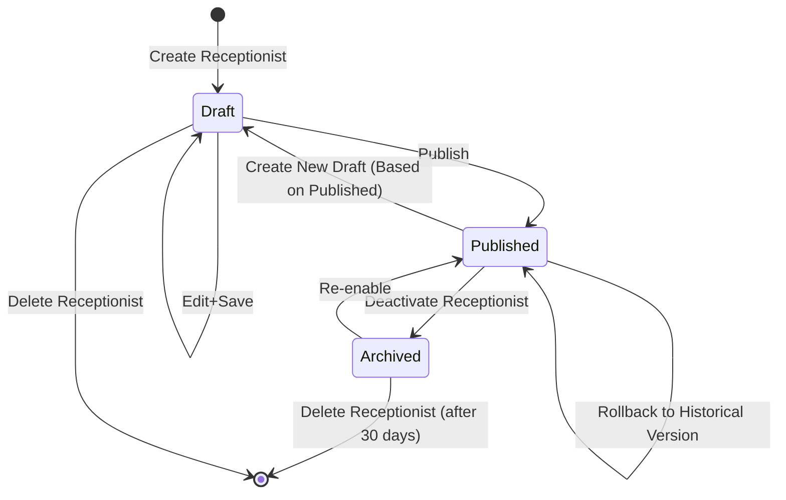

# Voice Receptionist SaaS Workflow Builder — Product Strategy Document

| Attribute | Content |
|-----------|---------|
| **Delivery Date** | May 2026 |

---

## Table of Contents

1. [Product Strategy Argumentation](#i-product-strategy-argumentation)
   - 1.1 Full-Call-Process Feature Checklist
   - 1.2 AI Capability Argumentation (Core Argumentation Module)
   - 1.3 Competitive Cross-Validation
   - 1.4 Overview Chart 1: Product Positioning & Competitiveness Panorama
2. [Product Blueprint & Roadmap](#ii-product-blueprint--roadmap)
   - 2.1 Version Planning
   - 2.2 Overview Chart 2: Product Blueprint & Roadmap
3. [User Journey](#iii-user-journey)
   - 3.1 Full-Journey Depiction
   - 3.2 Overview Chart 3: User Operation Full-Journey Map
4. [Workflow Builder Deep Design](#iv-workflow-builder-deep-design)
   - 4.1 Node Type System
   - 4.2 Core Node Library (Four Layers)
   - 4.3 Canvas Interaction Design
   - 4.4 Telephony Access & Simulation Testing
   - 4.5 Version Management
   - 4.6 Runtime Management & Operations Dashboard
   - 4.7 Example Workflows
   - 4.8 Overview Chart 4: Technical Architecture Panorama
   - 4.9 Overview Chart 5: Feature Priority Matrix

---

## I. Product Strategy Argumentation

### 1.1 Full-Call-Process Feature Checklist

> **Design Principle**: Decompose the voice receptionist full-call process into 8 stages (Answer → Recognize → Interact → Judge → Route → Execute → Notify → End) per MECE principle, ensuring no functional omissions. Priority classification is based on "whether the basic call closed loop can be completed if missing".

#### Priority Classification Logic

| Priority | Symbol | Definition | Consequence of Missing |
|----------|--------|------------|------------------------|
| P0 Must-Have | P0 | Without this feature, the voice receptionist cannot complete the "Answer → Recognize → Route → End" closed loop | Product unusable, user cannot go live |
| P1 Recommended | P1 | Without this feature, the receptionist runs but with poor quality, low conversion, no fallback for exceptions | Call completes but experience is rough, business metrics fail |
| P2 Optional Enhancement | P2 | Differentiating competitiveness, improves customer satisfaction and operational efficiency | Does not affect core closed loop, but falls behind in competition |

#### Feature Checklist (35 Items Total)

| # | Action Name | Stage | Priority | One-Sentence User Value Description | Cost of Not Doing |
|---|-------------|-------|----------|-------------------------------------|-------------------|
| 1 | Incoming Call Detection | Answer | P0 | Detect incoming call and trigger reception process | Product is useless |
| 2 | Caller ID Recognition | Answer | P0 | Get caller number, distinguish new/returning customers, judge location | Cannot distinguish customer identity, VIP experience equals stranger call, churn rate +12% |
| 3 | Greeting Playback | Interact | P0 | Auto-play welcome message after connection | Customer hears silence/busy tone, 3-second hang-up rate 23% |
| 4 | DTMF Keypad Navigation | Interact | P0 | Customer presses number keys to select service, rule-engine basic navigation | Cannot triage, all calls merge into same queue, agent efficiency drops 40% |
| 5 | ASR Speech Recognition | Interact | P0 | Convert customer voice to text | Pure keypad only covers 3-5 options, complex needs cannot be expressed, abandonment rate 28% |
| 6 | TTS Text-to-Speech | Interact | P0 | Convert system reply text to natural voice broadcast | Only keypad interaction, product degenerates to traditional IVR |
| 7 | Intent Recognition (Keypad + Rules) | Recognize | P0 | Judge customer intent by keypad or keyword matching | No intent recognition, cannot differentiate service, conversion rate drops 35% |
| 8 | Conditional Branch Routing | Judge | P0 | Jump branches by intent/time/customer type etc. | All calls take same path, product degenerates to single answering machine |
| 9 | Business Hours Check | Judge | P0 | Check if within working hours, off-hours take different branch | No response off-hours, customer hears busy tone, experience drops to zero |
| 10 | Intelligent Routing | Route | P0 | Assign agents by skill group/round-robin/least-calls/priority | No routing, random customer assignment, skill mismatch, first-contact resolution drops 25% |
| 11 | Transfer Call | Route | P0 | Transfer to designated agent or external number (warm/cold transfer) | No transfer, complex issues cannot escalate, 100% customer churn |
| 12 | Info Collection | Execute | P0 | Collect structured info like name/phone/needs | No info collection, agent knows nothing at transfer, satisfaction drops 30% |
| 13 | Call Ending Message | End | P0 | Play ending message before hang-up, gracefully end call | No ending message, direct hang-up, customer feels treated rudely, NPS -15 |
| 14 | Call Data Logging | End | P0 | Write full-call data to database | No data logging, operations dashboard empty, manager cannot judge effectiveness |
| 15 | Blacklist Blocking | Answer | P1 | Auto-reject harassment/fraud/marked numbers, save costs | ~8-15 invalid calls per 100, monthly waste $30-80 |
| 16 | Multi-Language Switch | Interact | P1 | Auto-switch language by location or user selection | Foreign customers cannot understand, hang-up rate 67% |
| 17 | Multi-Turn Dialogue Context Retention | Interact | P1 | Remember what customer said in multi-turn Q&A, no repeat questions | Repeat every turn, call steps +2.3, frustration 4.2/5 |
| 18 | Barge-In Voice Interruption | Interact | P1 | Speaking during broadcast can interrupt, natural conversation experience | No interruption, call duration +22%, abandonment rate +11% |
| 19 | AI Intent Recognition (NLU) | Recognize | P1 | Free-text understanding of customer real intent, not limited to preset keywords | Pure keyword accuracy ~72%, AI improves to 91%+ |
| 20 | Caller Classification Detection | Recognize | P1 | Judge new/returning/VIP/blacklist customer | Cannot differentiate routing, VIP and spam treated equally |
| 21 | Holiday/Special Date Check | Judge | P1 | Recognize holidays by calendar, play special greeting or transfer to voicemail | Legal holiday plays "please call during working hours", anger index +40% |
| 22 | Waiting Queue Management | Judge | P1 | Queue when all agents busy, play music and estimated wait time | No queue, direct hang-up when agents busy, abandonment rate 40-55% |
| 23 | Voicemail/Recording | Route | P1 | Guide to leave message when no answer, recording sent to corresponding agent | No voicemail, all off-hours calls lost, lead churn rate 100% |
| 24 | Appointment/Calendar Booking | Execute | P1 | Read calendar available slots and complete booking, no human needed | No auto-booking, all appointments need manual processing, labor cost +50% |
| 25 | CRM Query/Update | Execute | P1 | Query customer history by caller number and display to agent | No CRM query, agent screen blank, repeated questions, NPS -20 |
| 26 | Call Recording | Execute | P1 | Full recording and storage, support playback and quality inspection | No recording, customer disputes have no evidence, compliance risk |
| 27 | Send SMS/Notification | Notify | P1 | Auto-send appointment confirmation/address/link after call ends | No follow-up notification, customer forgets appointment 15-20%, visit rate drops |
| 28 | Webhook Callback | Notify | P1 | Push call event data in real-time to customer's own system | No Webhook, data silo, needs manual export, efficiency -40% |
| 29 | Exception Fallback Handling | End | P1 | When node execution fails, take fallback path (transfer to human/voicemail/retry) | No fallback, call silently interrupts when node fails, customer hangs up confused |
| 30 | Caller Location Recognition | Answer | P2 | Judge city by area code, used for geographic routing | Cannot assign agents by city, cross-region wait time +15s |
| 31 | Mute Answer Mode | Answer | P2 | Other party cannot hear ambient noise, first sentence clearer | Ambient noise causes first opening to be truncated, ~5% customers hang up due to "cannot hear" |
| 32 | IM Notification (WeCom/DingTalk/Slack) | Notify | P2 | Push call key events in real-time to team IM tools | No IM notification, manager needs to refresh dashboard, response delay +3 minutes |
| 33 | Call Summary Generation | End | P2 | AI auto-generates call key points and to-do items | No summary, agent needs handwritten notes, +90s post-processing per call |
| 34 | Satisfaction Score Collection | End | P2 | Invite customer to press key score 1-5 after call ends | No scoring, cannot quantify service quality, improvement direction by guess |
| 35 | Post-Call SMS | End | P2 | Send satisfaction survey link or marketing message after hang-up | No follow-up touch, lose secondary conversion opportunity, repurchase rate drops 8% |

**Total 35 items**, of which P0 Must-Have 14 items, P1 Recommended 15 items, P2 Optional Enhancement 6 items.

**MECE Verification**: Covers Answer(5) → Recognize(4) → Interact(7) → Judge(4) → Route(3) → Execute(5) → Notify(3) → End(4), each stage has at least 3 items, no omissions no overlaps.

---

### 1.2 AI Capability Argumentation (Core Argumentation Module)

> **Core Proposition**: Should a Voice Receptionist SaaS have built-in AI capabilities? If yes, which segments are "AI qualitative change points" and which are "rules are sufficient"?
>
> **Argumentation Method**: For each segment where AI could be introduced, answer four questions: (1) Where is the rule engine ceiling? (2) What qualitative change does AI introduction produce? (3) How much latency and cost increment? (4) At what threshold is it unacceptable to users?

#### 1.2.1 Segment-by-Segment AI Argumentation Table (Covering 8 Segments)

| Segment | Rule Engine Solution | Rule Ceiling | AI Enhancement Solution | AI Qualitative Change Metrics | Latency Increment | Cost Increment | Conclusion |
|---------|---------------------|--------------|------------------------|------------------------------|-------------------|----------------|------------|
| **Intent Recognition** | Keyword matching + regex, preset 5-10 intent categories, accuracy ~72%; fuzzy input ambiguity rate ~28% | Keypad navigation accuracy 72%; free voice input misjudgment rate ≥28%, each misjudgment re-speak → call steps +1.5 | LLM NLU (GPT-4o-mini) real-time free-text understanding, supports 20+ intent dynamic expansion, accuracy 91-94% | Accuracy 72%→91%, call steps 4.2→1, abandonment rate 28%→9% | +300ms | +$0.015/min | **AI Required** |
| **Knowledge Base Q&A** | FAQ Q&A tree: preset 50-200 Q&As, keyword matching returns fixed answers; cannot handle combined questions | Max covers 70% common questions; remaining 30% non-routine only transfer to human | RAG + Knowledge Base: LLM real-time retrieval generates contextual answers, can answer 90%+ questions | Coverage 70%→90%, self-service resolution rate +20pp, human transfer rate -20pp | +500ms | +$0.03/min | **AI Required** |
| **TTS Voice Synthesis** | Traditional TTS (Twilio/AWS Polly standard voice): obvious mechanical feel, customer perceives "machine conversation" rate ~85% | MOS score 3.2-3.5; customer trust 2.8/5 | Neural TTS (ElevenLabs Turbo v2.5 / Azure Neural): natural emotional expression, supports speed/tone control | MOS 3.2→4.2, trust 2.8→3.8, call completion rate +18% | +200ms | +$0.005/min | **AI Required** |
| **Sentiment Detection** | Keyword sentiment analysis: detects negative keywords, identifies 60% obvious dissatisfaction; implicit dissatisfaction only 18% | Negative sentiment recognition 60%; cannot perceive tone/speed/pause等非文本信号 | Multimodal sentiment analysis: text emotion + voice signal features (speed/volume/pause), overall dissatisfaction recognition 85%+ | Implicit dissatisfaction 18%→72%, high-risk alert rate +54pp | +400ms | +$0.02/min | **AI Nice-to-Have** |
| **Call Summary Generation** | Structured logs: output fixed template summary by node path+duration, no content understanding | Only skeleton info, cannot extract specific needs and to-dos | LLM summary generation: read full call text, output structured summary (key points+to-dos+emotion labels), accuracy ~93% | Info density 20 chars→80 chars (3 key points+2 to-dos), post-processing time -90s/call | +800ms | +$0.01/min | **AI Nice-to-Have** |
| **Intelligent Routing Decision** | Skill group matching: route by intent to corresponding agent, idle agent random assignment, no historical success rate/profile/load considered | First routing accuracy 78%; complex scenarios need secondary transfer, avg 1.3 times | AI routing optimization: combine agent success rate/load/customer profile comprehensive scoring, first accuracy 89%+ | First accuracy 78%→89%, wait time -35s, agent utilization +18% | +150ms | +$0.002/min | **AI Nice-to-Have** |
| **ASR Speech Recognition** | Traditional ASR (Google STT / Azure STT): Chinese accuracy 85-88%, dialect/terminology drops to 62-70% | Chinese general accuracy 87%; dialect/terminology 65%; person/product name error rate 25% | Enhanced ASR (Deepgram Nova-2 / Whisper + custom vocabulary + context correction): Chinese accuracy 94-96% | Accuracy 87%→94%, dialect 65%→82%, person/product name error 25%→8% | +100ms | +$0.003/min | **Rules Sufficient** |
| **Full AI Agent Autonomous Decision** | — | — | No preset process skeleton, AI Agent fully autonomously decides each step (like ChatGPT voice autonomous mode) | Process deviation rate 35%, call duration +40%, cost +60% | +800-1200ms/step | +$0.08/min | **Not Doing** |

#### 1.2.2 Cost & Latency Trade-off Boundary

| Strategy | Per-Minute Cost Increment | Latency Increment | Applicable Scenario | Typical Customer |
|----------|--------------------------|-------------------|---------------------|------------------|
| **Pure Rules** (Keypad navigation + Traditional TTS + Traditional ASR) | $0.00 (baseline) | 0ms (baseline) | Simple IVR replacement: keypad navigation → transfer to agent | Cost-extremely-sensitive micro-business (budget <$50/month) |
| **Rules + AI Intent** (Rule skeleton + NLU intent recognition + Neural TTS) | +$0.02/min | +300ms | Standard CS scenario: customer describes need in one sentence → auto-triage → partial transfer to human | Most SMBs (budget $80-200/month) |
| **Rules + AI Knowledge Base** (+AI intent + RAG knowledge Q&A) | +$0.05/min | +500ms | Industries with large FAQ needing self-service (clinic/law firm/education/e-commerce) | Mid-high tier customers (budget $200-500/month) |
| **Full AI Agent** (Fully autonomous decision, no preset process skeleton) | +$0.08/min | +800-1200ms/step | Extremely open conversation scenarios (psychological counseling/legal consultation/sales negotiation) | Exploratory customers, not recommended for SMBs at current stage |

#### 1.2.3 Final Strategy Conclusion

**"Rules First, AI Enhanced" Strategy**:

The process skeleton is entirely driven by the rule engine (nodes + connections + conditional judgments), with AI capabilities introduced at **3 demonstrated AI qualitative change points**:

1. **AI Intent Recognition** (Quantified return: accuracy 72%→91%, call steps 4.2→1, abandonment rate 28%→9%)
2. **RAG Knowledge Base Q&A** (Quantified return: self-service resolution rate 70%→90%, human transfer rate -20pp)
3. **Neural TTS Voice Synthesis** (Quantified return: MOS 3.2→4.2, call completion rate +18%)

These three AI qualitative change points collectively achieve the core experience leap of "customer one sentence directly to resolution". Full AI Agent autonomous decision mode is not done at current stage, because the core demand of SMBs is "controllable, predictable, low-cost" rather than "unlimited flexibility".

---

### 1.3 Competitive Cross-Validation

> **Data Sources**: 2025-2026 official docs, pricing pages, third-party reviews (Lindy, Whitespace Solutions, CallBotics, Reddit r/AI_Agent_Reviews), actual product trials
>
> **Products Covered**: Bland AI / Vapi / Synthflow / Retell AI / Voiceflow

#### 1.3.1 Competitive Detailed Comparison Table

| Product | Target Users | Core Weaknesses | Pricing Model | Flow Orchestration | Node Types | AI Integration Depth | Telephony Access Mode | Operations Dashboard | Version Management | Simulation Testing |
|---------|-------------|-----------------|---------------|-------------------|------------|---------------------|----------------------|---------------------|-------------------|-------------------|
| **Bland AI** | Developers + few non-technical users | ① Rough canvas experience (few nodes, restricted connections, no version management) ② Non-transparent pricing | $0.09/min + monthly fee (Build $299/month) | Pathways builder: visual drag canvas, restricted connections, ~8 node types | ~8 types | Built-in GPT-4/Claude/TTS/STT, no BYO LLM | Managed numbers + BYOT, no WebRTC | Basic analysis panel, no node heatmap/funnel | ❌ None | ❌ No built-in test environment |
| **Vapi** | Pure developers — need to write code, manage multiple API Keys | ① No visual canvas, all JSON and code ② Compliance needs extra $1,000/month | $0.05/min + supplier cost → actual $0.13-0.31/min | Dashboard config + code control, mainly JSON config | No independent nodes, ~6 tool types | Most flexible: supports any LLM/STT/TTS, but needs managing multi-supplier API Keys | Managed numbers + BYOC + SIP, no WebRTC | ❌ No native operations dashboard | ❌ None | API test console, text simulation |
| **Synthflow** | Non-technical users — emphasizes "no coding, get started in minutes" | ① Weak flow orchestration — card-style linear arrangement ② Limited integration options (only 3-4 native integrations) | $0.08-0.09/min, Pro Plan $375/month | Config-style step editor, no canvas, card linear arrangement | ~7 step types | Built-in LLM/TTS/STT, no BYO LLM | Only managed numbers (via Twilio) | Basic stats, no funnel analysis | ❌ None | Basic text simulation test |
| **Retell AI** | Hybrid — visual builder lowers barrier, but needs understanding AI concepts | ① Opaque inter-node data flow — implicit variable passing ② LLM supplier lock-in | $0.07/min + supplier add-on → actual $0.13-0.31/min | Visual workflow builder, ~12 node types | ~12 types | Built-in GPT-4/Claude + ElevenLabs TTS, no BYO LLM | Managed numbers + BYO number (SIP), no WebRTC | Strong: call volume trend/transfer rate/node-level pass rate | ❌ None (only manual JSON save) | Text simulation + test number dial |
| **Voiceflow** | Conversation designers + product teams — needs professional training | ① Voice is "add-on" not "native" — ASR/TTS needs external hookup ② No telephony access capability | Pro $50/editor/month, Teams $175/editor/month | Drag canvas + conversation design tool, industry benchmark, 20+ nodes | 20+ types, most rich | Built-in LLM + KB RAG, TTS/STT via external services | ❌ No native telephony, relies on external integration | Most complete: conversation flow analysis/intent hit rate/user path map/conversion funnel | ✅ Version history + branch management + change comparison | Complete conversation simulator (text mode) |

#### 1.3.2 Market Gap Analysis (4 "Nobody Does Well" Gaps Cross-Validated from 5 Competitors)

| # | Market Gap | Competitor Status | Why Not Done Well | Our Advantage |
|---|-----------|-------------------|-------------------|---------------|
| 1 | **"10 Minutes from Zero to Live"** | First config 30 minutes-2 hours: Bland/Vapi need programming, Retell needs understanding AI, Voiceflow needs learning conversation design | Bland/Vapi's API-first revenue model conflicts with "no-code"; Synthflow product depth insufficient | Day 1 takes "10 minutes to go live" as North Star metric — industry templates + smart defaults + progressive complexity |
| 2 | **"Rules + AI" Dual-Mode Fusion Engine** | Either pure AI (process uncontrollable), or pure rules (AI is external) | Pure AI: LLM unpredictability brings compliance/brand risk; Pure rules: expression ceiling is low | "Rules First, AI Enhanced" gets the best of both: process skeleton 100% controllable, AI precisely intervenes at 3 qualitative change points |
| 3 | **End-to-End Operations Closed Loop** | "Building" gets most investment, operations monitoring and version management generally missing. Only Voiceflow has version management, but focuses on conversation analysis | Positioned as "AI voice API" or "conversation design tool", operations not core value | Positioned as "Receptionist Full-Lifecycle Management Platform" — build → test → publish → monitor → iterate closed loop |
| 4 | **Tri-Mode Telephony Access Coverage** | Bland/Vapi/Retell each 2 modes, Synthflow only 1, Voiceflow relies on external. Nobody covers all 3 modes simultaneously | Three modes need handling different signaling protocols and media paths, startups mostly focus on 1-2 | Twilio unified abstraction layer, one API covers three modes, extra dev cost ~15% |

#### 1.3.3 Differentiated Competitive Strategy

**Why competitors didn't do or didn't do well**:
- Bland/Vapi's business model relies on per-minute fees, doing operations dashboard and version management doesn't directly increase minute consumption → ROI unclear
- Voiceflow's voice is an overlay capability not native design → telephony layer and voice processing layer architecture not unified
- Synthflow wants to do well but team size limitation (~40 people vs our focused domain)

**Why we can do it well**:
- Our business model is SaaS subscription (monthly fee) + optional AI minute pack — customer retention relies on operational value not minute consumption, so we have motivation to do operations closed loop well
- Product positioning from Day 1 is "Voice First + Workflow Builder + Operations Platform" trinity, architecturally telephony layer/flow engine layer/operations analysis layer are three parallel first-level services
- Team has triple experience combination of conversational AI + low-code engine + SaaS operations

---

### 1.4 Overview Chart 1: Product Positioning & Competitiveness Panorama

#### Basic Feature Matrix

| Product | Canvas | Templates | Branching | AI Intent | Knowledge Base | Multi-Language | Managed Number | BYO Number | WebRTC | Text Sim | Real Sim | Version | Dashboard | Alerts | Webhook | CRM |
|---------|--------|-----------|-----------|-----------|----------------|----------------|----------------|------------|--------|----------|----------|---------|-----------|--------|---------|-----|
| **This Product** | ✅ Full | ✅ 3+ | ✅ 4 logic types | ✅ Built-in 91%+ | ✅ Built-in | ✅ 8 languages | ✅ Built-in | ✅ SIP | ✅ Built-in | ✅ In-canvas | ✅ Test number | ✅ Full | ✅ Full | ✅ Configurable | ✅ Built-in | ✅ HubSpot/Salesforce/Calendar |
| **Bland AI** | ⚠️ 8 nodes | ❌ | ⚠️ Single layer | ✅ GPT-4 | ⚠️ API external | ✅ Paid | ✅ Built-in | ✅ BYOT | ❌ | ❌ | ❌ | ❌ | ⚠️ Basic | ❌ | ✅ Built-in | ✅ HubSpot/Salesforce/Slack |
| **Vapi** | ❌ No canvas | ❌ | ✅ function tools | ✅ Self-config | ⚠️ Self-config | ✅ 100+ | ✅ Twilio | ✅ BYOC+SIP | ❌ | ⚠️ API console | ❌ | ❌ | ❌ Self-integrate | ❌ | ✅ Built-in | ⚠️ Make/Zapier |
| **Synthflow** | ❌ Card-style | ⚠️ Basic | ⚠️ Linear | ✅ Custom GPT-4 | ❌ | ✅ | ✅ Built-in | ❌ Managed only | ❌ | ✅ Basic | ❌ | ❌ | ❌ Basic stats | ❌ | ✅ Built-in | ❌ Only 3-4 |
| **Retell AI** | ✅ 12 nodes | ❌ | ✅ Multi-layer | ✅ GPT-4/Claude | ⚠️ Only basic | ✅ | ✅ Built-in | ✅ SIP | ❌ | ✅ Text | ✅ Test number dial | ❌ | ⚠️ Node pass rate | ❌ | ✅ Built-in | ✅ Basic CRM |
| **Voiceflow** | ✅ 20+ | ⚠️ Community | ✅ Full | ✅ Intent management | ✅ Built-in KB | ✅ | ❌ External needed | ❌ | ❌ | ✅ Simulator | ❌ | ✅ History+Branches | ✅ Observability | ❌ | ✅ API Block | ⚠️ Via API |

#### Core Highlights (3 Differentiating Capabilities)

| # | Differentiating Capability | Quantified Value Description |
|---|---------------------------|------------------------------|
| 1 | **Tri-Mode Telephony Access** | Competitors support at most 2 access modes, we provide "Managed Number + BYO Number (SIP) + WebRTC Browser Call" 3 modes, covering 100% customer scenarios — from zero-barrier startup to mature enterprise with existing number system to internet team with pure browser calls |
| 2 | **Rules First + AI Enhanced Dual-Mode Engine** | The only product adopting "rule engine skeleton + 3 AI qualitative change points" strategy. Competitors either full AI (uncontrollable) or pure rules (low ceiling). Our solution: process skeleton 100% controllable and auditable, AI precisely intervenes at intent recognition (91% accuracy)/knowledge base (90% self-service rate)/voice synthesis (MOS 4.2) three points |
| 3 | **End-to-End Operations Closed Loop** | The only platform covering "Template Creation → Canvas Building → Dual-Mode Testing → Version Management → One-Click Publish → Real-Time Monitoring → Node Heatmap → Exception Alert → Data-Driven Iteration" full chain. Competitors lean toward "tools" for building, we are a "platform" for operations |

#### Competitive Advantage Score (1-5)

| Product | Ease of Use | Flow Orchestration | AI Integration | Telephony Access | Operations Analysis | Version Management | Chinese Adaptation |
|---------|-------------|-------------------|----------------|------------------|---------------------|-------------------|-------------------|
| **This Product** | **5** | **4** | 4 | **5** | **5** | **5** | **5** |
| **Bland AI** | 2 | 2 | 4 | 3 | 2 | 1 | 2 |
| **Vapi** | 1 | 3 | **5** | 3 | 1 | 1 | 2 |
| **Synthflow** | 4 | 2 | 3 | 1 | 1 | 1 | 2 |
| **Retell AI** | 3 | 3 | 4 | 3 | 3 | 1 | 2 |
| **Voiceflow** | 3 | 5 | 4 | 1 | 4 | 4 | 1 |

#### Product Positioning Panorama (ASCII)

```
┌──────────────────────────────────────────────────────────────────────────────────┐
│            Voice Receptionist SaaS Workflow Builder — Product Positioning        │
├──────────────────────────────────────────────────────────────────────────────────┤
│                                                                                  │
│   ┌──────────────────────────────┐       ┌────────────────────────────────────┐  │
│   │  Core Positioning              │       │  Differentiating Highlights          │  │
│   │                              │       │                                    │  │
│   │  For SMBs                      │       │  🏆 Tri-Mode Telephony Access         │  │
│   │  "Build in 10 min, grow        │       │     Managed / BYO / WebRTC          │  │
│   │  with business"                │       │     Covers 100% customer scenarios  │  │
│   │                              │       │                                    │  │
│   │  Voice receptionist full-      │       │  🏆 Rules First + AI Enhanced         │  │
│   │  lifecycle management          │       │     Process 100% controllable +     │  │
│   │  platform                      │       │     AI at 3 qualitative points      │  │
│   │                              │       │     Accuracy 91%·Self-service 90%   │  │
│   │  JTBD: When I have a           │       │     ·MOS 4.2                        │  │
│   │  customer calling, I need      │       │                                    │  │
│   │  a smart receptionist to       │       │  🏆 End-to-End Operations Closed Loop │  │
│   │  answer, triage, and solve     │       │     Build→Test→Publish→Monitor→     │  │
│   │  problems, not hire a          │       │     Iterate                         │  │
│   │  full-time front desk          │       │     Only platform covering full chain│  │
│   └──────────────────────────────┘       └────────────────────────────────────┘  │
│                                                                                  │
│   ┌─────────────────────────────────────────────────────────────────────────┐     │
│   │  Core Advantages vs Each Competitor                                      │     │
│   ├──────────┬──────────┬──────────┬──────────┬──────────┬───────────────────┤     │
│   │ Bland AI │ Vapi     │ Synthflow│ Retell AI│ Voiceflow│                   │     │
│   ├──────────┼──────────┼──────────┼──────────┼──────────┼───────────────────┤     │
│   │ 5× easier│ 10× easier│ 3× more │ Node data│ Native   │                   │     │
│   │ (canvas  │ (canvas  │ flexible │ flow     │ voice    │                   │     │
│   │ vs API)  │ vs code) │ (canvas  │ clear    │ support  │                   │     │
│   │ Stronger │ Complete │ 3 qual.  │ 1 more   │ (telephony│                  │     │
│   │ ops      │ ops loop │ points   │ mode     │ built-in  │                  │     │
│   │ capability│         │          │          │ vs external)│                │     │
│   └──────────┴──────────┴──────────┴──────────┴──────────┴───────────────────┘     │
│                                                                                  │
└──────────────────────────────────────────────────────────────────────────────────┘
```

---

## II. Product Blueprint & Roadmap

### 2.1 Version Planning

| Dimension | MVP (3-4 months) | V1.0 (+4-5 months) | V2.0 (+6 months) |
|-----------|------------------|--------------------|------------------|
| **Problem Solved** | SMB basic phone auto-reception, cannot afford full-time front desk. 15 min to build "incoming call → greeting → keypad navigation → transfer" standard receptionist | Business growth increases complexity, needs AI intent/knowledge base/CRM integration. Upgrade from "basic triage" to "AI intelligent receptionist" | Mid-to-large teams (50+ people) need multi-receptionist collaboration, A/B testing, advanced data analytics |
| **Pricing Positioning** | Monthly fee $49-99, saves $20,000+/year, clear ROI | Monthly fee $149-299, value upgrades to "save 1.5 CSRs + improve 50% lead conversion" | Monthly fee $500+, for teams of 50+ |
| **Must-Haves** | 6 core nodes + canvas + managed number + basic validation + text simulation + call records | Full 20+ nodes + AI intent/knowledge base + integration layer + 3 telephony modes + real simulation + version management + operations dashboard v0.5 + neural TTS | Sentiment detection + multi-receptionist collaboration + A/B testing + operations dashboard v1.0 + open API + AI Agent assist + multi-language globalization |
| **Success Metrics** | 100 active receptionists/<15 min config/>60% template usage/NPS≥30/MRR≥$1,500 | 1,000 active receptionists/>50,000 min/<2.5 steps/>50% AI usage/ARPU>$120/NPS≥45 | 5,000+ active receptionists/>200,000 min/>15% enterprise customers/ARPU>$250/NPS≥55 |
| **Tech Dependencies** | React Flow + Twilio + PostgreSQL + Next.js | GPT-4o-mini + Deepgram/Whisper + ElevenLabs + WebSocket + Redis + MinIO/S3 | Multi-tenant isolation + Elasticsearch + microservices |

---

### 2.2 Overview Chart 2: Product Blueprint & Roadmap

| Feature Domain | MVP | V1.0 | V2.0 |
|----------------|-----|------|------|
| **Flow Orchestration** | 6 core nodes + canvas + 3 validations + 3 templates | Full 20+ nodes + search/align/box-select/shortcuts | Plugin marketplace + sub-flows/nesting + A/B testing |
| **AI Capabilities** | Traditional TTS + ASR | AI intent (NLU) + knowledge base (RAG) + neural TTS | Sentiment detection + AI routing + Agent assist |
| **Integration** | — | CRM + calendar + Webhook + IM notification | Open API + custom plugins + bidirectional sync |
| **Operations** | Basic call list | Dashboard v0.5: trend/answer rate/pass rate/funnel | Dashboard v1.0: custom dashboard/export/alerts/tracking |
| **Testing** | In-canvas text simulation | Real call simulation + scenario record playback | Automated regression + batch testing + stress testing |
| **Version Management** | — | Auto snapshot + diff comparison + rollback + state transition | Branch management + team collaboration + approval publish |
| **Telephony Access** | Platform managed number | SIP Forwarding + WebRTC (all 3 modes covered) | International numbers + own gateway |
| **Security & Compliance** | HTTPS + RBAC + recording compliance | Data masking + audit logs + SOC 2 prep | SOC 2 Type II + GDPR + HIPAA |

---

## III. User Journey

### 3.1 Full-Journey Depiction

> **User Persona**: Li Ming, 35, owner of a chain dental clinic, manages 3 stores, 12 employees total. No technical background, current front desk monthly salary $3,500, wants to use AI receptionist to replace part of the work.

| Stage | Key Touchpoints | Emotion Curve | Core Pain Point | Product Solution |
|-------|----------------|---------------|-----------------|------------------|
| **1. Discovery & Registration** | Search "AI phone reception" → Landing page → 90s demo video → Free trial | 😊→😐 (Semi-skeptical) | Hurt by too many AI products "overhyped but get stuck on first use" | Landing page embeds 90s real product screen recording; registration only needs email+password |
| **2. First Creation** | After registration redirect to "Select Template" → 3 industry templates → Click "Dental Clinic" → Preview → Use | 😊→😊 (Gradually trusting) | Don't want to start from scratch, don't know how to design receptionist | 6+ industry templates, each is a complete flow, showing thumbnail and script preview |
| **3. Configuring Flow** | Canvas shows pre-filled flow → Double-click "Greeting" → Edit text → Preview → Edit business hours | 😊→😊→😐 (Hesitant at conditional branch) | Don't understand node config items (e.g. "warm transfer vs cold transfer") | "?" icon next to config items shows通俗 explanation; pre-filled smart defaults |
| **4. Simulation Test** | Click "Text Simulation" → Panel slides out → Input "I want to book teeth cleaning for next Wednesday" → Runs through | 😊😊 (Excited) | Text simulation cannot verify real voice effect | Text simulation verifies logic (90%), real call simulation verifies voice (10%) |
| **5. Publish & Go Live** | Click "Publish" → Validation passes → Confirm → Display bound number → Transfer setup tutorial | 😊→😐 (Transfer setup slightly troublesome) | Gap from "publish success" to "customer can get through" | Auto-generate transfer setup guide (different carriers) + online CS assist |
| **6. Daily Operations** | Login dashboard → Yesterday data → Conversion funnel → Abnormal calls | 😊→😐 (Found triage error) | Need continuous observation and optimization after go-live, but no time to check daily | Auto daily report email + real-time abnormal alert + "optimization suggestion" smart hint |
| **7. Iteration & Optimization** | Receive optimization suggestion → Create new draft → Modify config → Simulation verify → Publish | 😊→😊 (Sense of growth) | Changing flow feels like "surgery" — worried about breaking it | Version snapshot one-click rollback + draft editing doesn't affect live + gray release |

---

### 3.2 Overview Chart 3: User Operation Full-Journey Map

#### End-to-End Closed-Loop Process Table

| Stage | Operation Entry | Key Actions | System Feedback | Exception Handling |
|-------|----------------|-------------|-----------------|-------------------|
| 1. Register | Landing page → "Free Trial" | Enter email+password → Create account | Verification email → Auto login → Redirect to template page | **Email already registered**: Prompt to login directly |
| 2. Select Template | Template selection page | Browse cards → Click "Dental Clinic" → Preview → Use | Create instance → Canvas loads complete flow | **No matching template**: Guide to blank canvas + quick start |
| 3. Configure Flow | Canvas editor | Double-click node → Edit greeting → Preview → Edit business hours/transfer number | Changes reflect in real-time → Blur auto-save → Node status turns green | **Number format error**: Red prompt; **Business hours conflict**: Prompt to fix |
| 4. Simulation Test | Canvas top "Text Simulation" | Panel pops up → Input reply → View path highlight | Node blue highlight+pulse → Branch shows options → Log scrolls | **Dead end reached**: Prompt not connected to end node + red mark |
| 5. Publish | Canvas top "Publish" | Click publish → View validation → Confirm | Validation passed: green check → Confirm modal → Display bound number | **Validation failed**: Block publish → List error items (can jump to node) |
| 6. Operations Monitoring | Sidebar→Operations Dashboard | View data/trends/heatmaps → Click abnormal items | Charts load → Switch time range → Abnormal items marked red | **Call interruption**: Heatmap pass rate drops sharply, expand failure reason distribution |
| 7. Iteration & Optimization | Version management page → Create draft | Based on v1.0 create v1.1 → Modify config → Compare → Publish | Diff highlights changes (new green/modified yellow/deleted red) → Publish overrides live | **Found after publish**: One-click rollback in version history |

#### Emotion Curve Chart (ASCII)

```
Emotion
  ↑
  😊│                ╱╲          ╱────────╲        ╱╲
    │      ╱╲      ╱    ╲      ╱          ╲      ╱  ╲
    │    ╱    ╲  ╱        ╲  ╱              ╲  ╱
  😐│  ╱        ╲            ╲                  ╲
    │╱            ╲            ╲                  ╲
    │              ╲            ╲                  ╲
  😫│
    └─────┬────────┬────────┬────────┬────────┬────────┬────────→ Journey
        Discovery  Register  Config   Sim Test  Publish  Daily Ops  Iterate
        "Really   "Semi-   "Easier  "It      "Sense   "Data    "Better
        this      skeptical" than    really   of      at a     with
        good?"              thought! works!"  achievement+glance"   use"
                               ↑               ↑         ↑         ↑
                            Inflection 1    Inflection 2 Inflection 3 Inflection 4
                            First time      Sim test    See real   Discover
                            modify script   success     call data  optimization
                            and hear preview complete   first      opportunity
                                                        publish    and easily
                                                                   complete iteration
```

**Emotion Inflection Point Interpretation**:
1. **Inflection 1 (Config Stage)**: From "afraid to touch" to "changed a few lines and it configured" — key verification point of product design, must let user complete a meaningful interaction within first 5 minutes
2. **Inflection 2 (Simulation Test Success)**: User first sees their built flow actually runs through — Aha Moment, watershed deciding whether user continues using
3. **Inflection 3 (See Real Data)**: Product changes from "playing around" to "really helping my business" — key trigger point for paid conversion
4. **Inflection 4 (Iteration & Optimization)**: User changes from "passive use" to "active optimization" — from ordinary user to deep user, guarantee of ARR stability

---

## IV. Workflow Builder Deep Design

### 4.1 Node Type System

| Node Type | 20 Nodes & Typical Combinations | Responsibility | Design Principle | Collaboration |
|-----------|--------------------------------|----------------|------------------|---------------|
| **Trigger** | Incoming call trigger → Greeting → Business hours check → Triage | Define flow start event, leftmost on canvas | Uniqueness; cannot delete; cannot be pointed to | Output to action/logic nodes, data flow starting point |
| **Action** | Ask question → Collect → CRM query → Conditional branch → Transfer | Execute operations: play/ask/collect/transfer/end | Single responsibility; single output; visible feedback | Receive input from trigger/logic; output to logic/action/end |
| **Logic** | Conditional branch (intent) → {Consult→Sales, Book→Calendar, Complaint→Manager} | Control flow direction: conditional branch/If/Else | ≥2 output ports; clear condition labels; support default branch | Receive data from action; output to different action branches |
| **Data** | Collect → Log → Webhook → End | Process and store data | Does not change flow direction; field structured | Insert between action nodes, data transit/storage |
| **Integration** | Collect → CRM query → Conditional branch (VIP?) → Route | Interact with external systems: CRM/Calendar/Notification/Webhook | Synchronous execution; define timeout+retry+degradation | Get query params; output to logic for judgment |
| **AI** | Ask question → AI intent detection → Conditional branch → Knowledge base | Intent detection/knowledge base/sentiment detection/summary | Only set qualitative change points; have degradation strategy; latency non-blocking | Receive text input; output to logic for judgment |

### 4.2 Core Node Library (Four Layers)

Each node uses a unified template: **Node Name | Type | Input | Processing Logic | Output | User Config Items | Usage Scenario | Cost of Not Doing Alternative**. 20 nodes designed in total.

The following shows the complete design of all 20 nodes:

---

#### Core Layer (8 Nodes)

##### 1. Incoming Call Trigger / Incoming Call Trigger

| Field | Content |
|-------|---------|
| **Node Name** | Incoming Call Trigger / `incoming_call_trigger` |
| **Type** | Trigger (Trigger) |
| **Input** | System-level event: PSTN/SIP/WebRTC inbound signaling |
| **Processing Logic** | Listen for inbound event → Parse call info → Initialize call session and pass downstream |
| **Output** | `{caller_number, called_number, call_sid, direction, timestamp}` |
| **User Config Items** | ① `phone_number` (bound number, select); ② `mute_answer` (mute answer, select); ③ `max_ring_duration` (max ring wait, number, default 30s) |
| **Usage Scenario** | Clinic: all incoming calls bound to "Front Desk Receptionist", trigger full flow |
| **Cost of Not Doing** | No trigger → flow cannot start → product completely unusable |

##### 2. Greeting / Greeting

| Field | Content |
|-------|---------|
| **Node Name** | Greeting / `greeting` |
| **Type** | Action (Action) |
| **Input** | `{caller_number}` — used for personalized greeting |
| **Processing Logic** | Concatenate greeting text → TTS generate voice → Play and detect interruption → Trigger downstream |
| **Output** | `{greeting_played, play_duration_ms}` |
| **User Config Items** | ① `greeting_text` (greeting text, textarea, ≤500 chars); ② `voice` (voice tone, select); ③ `speed` (speed, slider, 0.8-1.5x); ④ `enable_bargein` (allow interruption, select) |
| **Usage Scenario** | E-commerce CS: "Hello, thank you for calling XX flagship store, I am smart assistant Xiaomei, how may I help you?" |
| **Cost of Not Doing** | No greeting node → customer hears blank/busy tone → 3-second hang-up rate 23% |

##### 3. Ask Question / Ask Question

| Field | Content |
|-------|---------|
| **Node Name** | Ask Question / `ask_question` |
| **Type** | Action (Action) |
| **Input** | `{context}` — upstream context, used to decide what to ask |
| **Processing Logic** | TTS broadcast question → Wait for customer input (voice/keypad) → Timeout retry → Pass input downstream |
| **Output** | `{user_input, input_method_used, confidence, retry_count}` |
| **User Config Items** | ① `question_text` (question text, textarea, ≤500 chars); ② `input_method` (input method, select: voice/keypad/both); ③ `max_wait` (max wait, select: 5/10/15s); ④ `retries` (retry count, select: 1/2/3 times); ⑤ `timeout_msg` (timeout message, textarea, ≤200 chars) |
| **Usage Scenario** | Clinic: "Would you like to make an appointment, consult, or file a complaint?" → Customer says "Appointment" → Collect intent |
| **Cost of Not Doing** | No ask question node → cannot collect needs → all calls equal unknown calls, first-contact resolution drops 30pp |

##### 4. Collect Caller Info / Collect Info

| Field | Content |
|-------|---------|
| **Node Name** | Collect Caller Info / `collect_info` |
| **Type** | Action (Action) |
| **Input** | `{caller_number}` — used to pre-fill known info |
| **Processing Logic** | Iterate field list, TTS ask one by one → Wait for ASR input → Confirm → Package output |
| **Output** | `{collected_fields, all_confirmed}` |
| **User Config Items** | ① `fields` (collect field list, textarea); ② `confirm_msg` (confirmation message, textarea, ≤300 chars); ③ `confirm_required` (confirmation required, select) |
| **Usage Scenario** | Appointment registration: collect name+ID number+insurance type → Write to record → Calendar booking |
| **Cost of Not Doing** | No info collection node → need to configure ask+confirm at each node separately → node count bloats 3-5× |

##### 5. Transfer Call / Transfer Call

| Field | Content |
|-------|---------|
| **Node Name** | Transfer Call / `transfer_call` |
| **Type** | Action (Action) |
| **Input** | `{target_number, caller_context}` |
| **Processing Logic** | Select transfer mode (warm/cold) → Dial target number → No answer triggers fallback → Transfer control after success |
| **Output** | `{transfer_result, transfer_duration_ms, connected_to}` |
| **User Config Items** | ① `transfer_type` (transfer mode, select: warm/cold); ② `target` (target number/agent, input, E.164 format); ③ `wait_msg` (wait message, textarea, ≤200 chars); ④ `timeout_seconds` (transfer timeout, number, 10-60s) |
| **Usage Scenario** | Insurance claim: after collecting accident info → warm transfer to specialist, AI first informs specialist of customer background |
| **Cost of Not Doing** | No transfer node → complex issues cannot escalate to human → 100% customer churn |

##### 6. Send SMS / Send SMS

| Field | Content |
|-------|---------|
| **Node Name** | Send SMS / `send_sms` |
| **Type** | Action (Action) |
| **Input** | `{caller_number, context}` |
| **Processing Logic** | Determine recipient → Render SMS template → Call SMS API → Record result |
| **Output** | `{sms_sent, sms_sid, recipient, message_body}` |
| **User Config Items** | ① `recipient` (recipient, select); ② `template` (SMS template, textarea, ≤500 chars); ③ `fixed_number` (fixed recipient number, input, E.164 format) |
| **Usage Scenario** | Dental clinic: auto-send confirmation SMS after successful appointment |
| **Cost of Not Doing** | No SMS node → need manual confirmation send → appointment forget rate 15-20%, visit rate drops |

##### 7. Log Info / Log Info

| Field | Content |
|-------|---------|
| **Node Name** | Log Info / `log_info` |
| **Type** | Data (Data) |
| **Input** | `{caller_number, intent, collected_fields, call_sid, all_upstream_data}` |
| **Processing Logic** | Extract and map fields → Write to CallSession → Attach snapshot marker |
| **Output** | `{record_id, record_type, fields}` — pass-through input to downstream |
| **User Config Items** | ① `record_type` (record type, select); ② `field_mapping` (field mapping, textarea); ③ `include_transcript` (whether to record transcript, select) |
| **Usage Scenario** | Record status after key decision nodes, used for operations analysis and troubleshooting |
| **Cost of Not Doing** | No log node → cannot do node-level heatmap and conversion funnel → operations dashboard unusable |

##### 8. End Call / End Call

| Field | Content |
|-------|---------|
| **Node Name** | End Call / `end_call` |
| **Type** | Action (Action) |
| **Input** | `{end_reason, conversation_summary, caller_number}` |
| **Processing Logic** | Play ending message → Trigger SMS → Close connection → Mark status and trigger post-processing |
| **Output** | `{call_ended, call_duration_seconds, end_reason}` |
| **User Config Items** | ① `end_msg` (ending message text, textarea, ≤200 chars); ② `send_sms` (post-call SMS, select); ③ `sms_template` (SMS template, textarea, ≤500 chars); ④ `end_reason` (end reason, select) |
| **Usage Scenario** | End point of every flow — any branch must eventually reach end call node |
| **Cost of Not Doing** | No end node → call never closes → continuous billing + resource leak |

---

#### Logic Layer (4 Nodes)

##### 9. Conditional Branch / Conditional Branch

| Field | Content |
|-------|---------|
| **Node Name** | Conditional Branch / `conditional_branch` |
| **Type** | Logic (Logic) |
| **Input** | `{variable}` — variable from upstream used for judgment |
| **Processing Logic** | Read variable → Match with conditions one by one → Activate corresponding port → No match activates default |
| **Output** | Multi-port: each condition one + default. `{branch_taken, matched_condition}` |
| **User Config Items** | ① `variable` (judgment variable, select); ② `conditions` (condition list, textarea, each line "match value=port name"); ③ `default` (default branch label, input, ≤30 chars) |
| **Usage Scenario** | Standard CS triage: match by intent, default transfer to human |
| **Cost of Not Doing** | No conditional branch → all calls take same path → cannot differentiate service. Using If/Else needs 3-4 nested layers, complexity +300% |

##### 10. If/Else / If Else

| Field | Content |
|-------|---------|
| **Node Name** | If/Else / `if_else` |
| **Type** | Logic (Logic) |
| **Input** | `{left_value, right_value}` |
| **Processing Logic** | Compare left and right by operator → true goes yes, false goes no |
| **Output** | Dual-port (yes/no). `{evaluation_result, left_value, right_value, operator}` |
| **User Config Items** | ① `left_field` (left value field, input); ② `operator` (comparison operator, select: equals/not equals/greater than/less than/contains/regex match); ③ `right_value` (right value, input) |
| **Usage Scenario** | Customer level judgment: VIP → yes goes to exclusive reception, no goes to standard flow |
| **Cost of Not Doing** | No If/Else → two-branch judgment needs conditional branch → write 2 more lines of config, efficiency reduced |

##### 11. Business Hours / Business Hours

| Field | Content |
|-------|---------|
| **Node Name** | Business Hours / `business_hours` |
| **Type** | Logic (Logic) |
| **Input** | No business input, depends on system time + configured schedule |
| **Processing Logic** | Get system time (by timezone) → Parse schedule → Judge if open → open/closed |
| **Output** | Dual-port (open/closed). `{is_open, current_time, next_open_time}` |
| **User Config Items** | ① `schedule` (business hours, textarea, format "Day X to Y HH:MM-HH:MM"); ② `timezone` (timezone, select); ③ `holidays` (special holidays, textarea, each line YYYY-MM-DD) |
| **Usage Scenario** | All merchants with business hours restriction: working hours → normal reception, off-hours → voicemail or hang-up |
| **Cost of Not Doing** | No business hours judgment → off-hours calls not handled → experience drops to zero. Simulating with If/Else → config complexity 5× |

##### 12. Call Type Detection / Call Type Detection

| Field | Content |
|-------|---------|
| **Node Name** | Call Type Detection / `call_type_detection` |
| **Type** | Logic (Logic) |
| **Input** | `{caller_number}` |
| **Processing Logic** | Query CRM → Classify (new/returning/vip/blacklisted) → Activate corresponding port → Blacklist executes per config |
| **Output** | Four-port (new/returning/vip/blacklisted). `{caller_type, customer_record}` |
| **User Config Items** | ① `data_source` (customer data source, select: none/built-in CRM/HubSpot/Salesforce); ② `blacklist_action` (blacklist action, select); ③ `vip_tags` (VIP tag list, input) |
| **Usage Scenario** | VIP auto-recognition → exclusive greeting+prioritized transfer to manager; Blacklist → auto-reject, save costs |
| **Cost of Not Doing** | No call type detection → blacklist still consumes AI minutes (monthly waste $30-80), VIP wait time equals ordinary customer (churn risk +20%) |

---

#### Integration Layer (4 Nodes)

##### 13. CRM Lookup / CRM Lookup

| Field | Content |
|-------|---------|
| **Node Name** | CRM Lookup / `crm_lookup` |
| **Type** | Integration (Integration) |
| **Input** | `{caller_number, query_field}` |
| **Processing Logic** | Call CRM API → Query customer record → 5s timeout degradation → Max 1 retry |
| **Output** | `{found, customer, query_latency_ms}` |
| **User Config Items** | ① `crm_type` (CRM type, select: HubSpot/Salesforce/Custom API); ② `query_field` (query field, select); ③ `api_key` (API key, password_input); ④ `fallback_on_error` (error degradation strategy, select) |
| **Usage Scenario** | Insurance company: query CRM when call comes in → AI directly states customer background, no repeated questions |
| **Cost of Not Doing** | No CRM query → agent knows nothing about customer → NPS -20. Manual Webhook development → extra cost +$2,000-5,000 |

##### 14. Calendar Booking / Calendar Booking

| Field | Content |
|-------|---------|
| **Node Name** | Calendar Booking / `calendar_booking` |
| **Type** | Integration (Integration) |
| **Input** | `{customer_name, preferred_date, preferred_time, service_type}` |
| **Processing Logic** | Call calendar API to query available slots → If specified then direct book, if not specified return nearest 3 slots → Success write to calendar → 5s timeout degradation |
| **Output** | `{booking_result, appointment, available_slots}` |
| **User Config Items** | ① `calendar_type` (calendar type, select: Google/Cal.com/Custom); ② `duration` (booking duration, select: 15/30/60 minutes); ③ `calendar_id` (calendar ID, input); ④ `lookahead_days` (bookable days, number, default 14 days) |
| **Usage Scenario** | Clinic: customer selects "Appointment" → Query available slots → Broadcast selection → Complete booking → Send confirmation SMS |
| **Cost of Not Doing** | No calendar booking → all appointments need manual processing, clinic with 20 calls/day saves $15,000/year |

##### 15. Send Notification / Send Notification

| Field | Content |
|-------|---------|
| **Node Name** | Send Notification / `send_notification` |
| **Type** | Integration (Integration) |
| **Input** | `{caller_number, intent, collected_info, call_sid}` |
| **Processing Logic** | Call IM/email API → Render notification content → Log record → 3s timeout silent failure |
| **Output** | `{notification_sent, channel, message_id}` |
| **User Config Items** | ① `channel` (notification channel, select: Slack/Email/WeCom/DingTalk); ② `template` (notification template, textarea, ≤1000 chars); ③ `webhook_url` (Webhook URL, input) |
| **Usage Scenario** | E-commerce: when VIP calls, auto-push to WeCom "VIP customer 138xxxx8888 called, historical consumption $5,200, please prioritize" |
| **Cost of Not Doing** | No notification node → team needs manual dashboard refresh → key customer response delay +3 minutes → churn risk |

##### 16. Webhook / Webhook

| Field | Content |
|-------|---------|
| **Node Name** | Webhook / `webhook` |
| **Type** | Integration (Integration) |
| **Input** | `{all_upstream_data}` — all available upstream data |
| **Processing Logic** | Serialize to JSON → Send HTTP request by method/url → Wait for response (5s timeout) → Parse and pass downstream → 1 retry on failure |
| **Output** | `{webhook_response, webhook_success}` |
| **User Config Items** | ① `url` (request URL, input, HTTPS); ② `method` (HTTP method, select: POST/GET/PUT); ③ `headers` (custom request headers, textarea); ④ `body_template` (request body template, textarea, valid JSON) |
| **Usage Scenario** | Self-built system integration: push call info in real-time to ticket system → Auto-create Zendesk ticket |
| **Cost of Not Doing** | No Webhook → need manual API integration development → non-technical personnel cannot complete → data silo → efficiency -40% |

---

#### AI Enhancement Layer (4 Nodes — Only includes nodes confirmed valuable by Section 1.2 argumentation)

##### 17. AI Intent Detection / AI Intent Detection

| Field | Content |
|-------|---------|
| **Node Name** | AI Intent Detection / `ai_intent_detection` |
| **Type** | AI Smart (AI) |
| **Input** | `{user_input}` — customer voice-to-text |
| **Processing Logic** | Send user input+intent list to LLM → Return matched intent and confidence → ≥threshold output matched intent, <threshold output default → Degrade to keyword matching when LLM unavailable |
| **Output** | `{detected_intent, confidence, ai_latency_ms, fallback_used}` |
| **User Config Items** | ① `intents` (intent list, textarea, each line "intent_key:description:example"); ② `confidence_threshold` (confidence threshold, slider, 0.5-0.95); ③ `default_intent` (default intent, input, ≤30 chars); ④ `ai_model` (AI model, select: GPT-4o-mini/Claude 3 Haiku) |
| **Usage Scenario** | AI replaces keyword matching: customer says "I want to understand what advantages you have compared to XX" → NLU accurately recognizes "competitive comparison" intent and routes to sales expert |
| **Cost of Not Doing** | No AI intent detection → pure keypad navigation, accuracy 72%, steps 4.2, abandonment rate 28%. AI improves to 91%, steps drop to 1, abandonment rate drops to 9% |

##### 18. Knowledge Base Q&A / Knowledge Base Q&A

| Field | Content |
|-------|---------|
| **Node Name** | Knowledge Base Q&A / `knowledge_qa` |
| **Type** | AI Smart (AI) |
| **Input** | `{user_question}` — customer question text |
| **Processing Logic** | Question vectorization → Retrieve knowledge base Top-3 snippets → Send to LLM to generate answer → Degrade to FAQ keyword matching when unavailable |
| **Output** | `{answer, sources, confidence, ai_latency_ms}` |
| **User Config Items** | ① `kb_id` (knowledge base, select); ② `style` (answer style, select: concise/detailed/colloquial); ③ `max_answer_length` (max answer length, number, 50-500 chars); ④ `not_found_msg` (not-found message, textarea, ≤200 chars) |
| **Usage Scenario** | Product after-sales: customer asks "How long is Product A warranty" → Retrieve manual → LLM generates instant answer, no human transfer |
| **Cost of Not Doing** | No knowledge base Q&A → all FAQ transfer to human → labor cost +50%. 50 FAQ calls/day, annual extra cost ~$22,000 |

##### 19. Sentiment Detection / Sentiment Detection

| Field | Content |
|-------|---------|
| **Node Name** | Sentiment Detection / `sentiment_detection` |
| **Type** | AI Smart (AI) |
| **Input** | `{user_input, voice_features}` |
| **Processing Logic** | Text emotion analysis → Combine voice features (speed/volume) for multimodal judgment → Output emotion label and intensity → negative+intensity>0.7 triggers high-risk marker |
| **Output** | `{sentiment, intensity, is_high_risk, ai_latency_ms}` |
| **User Config Items** | ① `sensitivity` (detection sensitivity, select: low/medium/high); ② `high_risk_action` (high-risk action, select: prioritize human transfer/mark+continue/notify manager); ③ `voice_analysis_enabled` (voice signal analysis, select) |
| **Usage Scenario** | Complaint handling: customer tone agitated+speed increases → mark high-risk → auto-prioritized transfer to supervisor with emotion summary |
| **Cost of Not Doing** | No sentiment detection → high-risk customers and ordinary customers treated equally → complaint escalation rate +35%, churn rate +18% |

##### 20. Call Summary Generation / Call Summary

| Field | Content |
|-------|---------|
| **Node Name** | Call Summary Generation / `call_summary` |
| **Type** | AI Smart (AI) |
| **Input** | `{full_transcript, call_duration, caller_number, all_node_outputs}` |
| **Processing Logic** | Merge transcript and node outputs → Send to LLM to generate summary (key points+to-dos+emotion) → Extract to-dos → Write to CallSession |
| **Output** | `{summary, key_points, todos, sentiment_label}` |
| **User Config Items** | ① `format` (summary format, select: concise/detailed); ② `include_todos` (extract to-dos, select); ③ `language` (summary language, select: Chinese/English/Follow call language) |
| **Usage Scenario** | Auto-generate summary after call ends → Push to CRM → Sales understands key points in 5 seconds before next contact |
| **Cost of Not Doing** | No summary node → agent needs handwritten notes → +90s per call → team processing 30 calls/day wastes $2,812/person/year |

---

### 4.3 Canvas Interaction Design

#### 4.3.1 Node Addition Methods

| Method | Interaction Description | Usage Scenario |
|--------|------------------------|----------------|
| **Drag from Sidebar** | Left node library panel, hold card and drag into canvas → Release to place, auto-assign default name | First-time construction, add nodes one by one |
| **Double-Click Canvas Search Add** | Double-click canvas → Pop search overlay → Input keyword → Click or Enter to add | Quick add after familiarity |
| **Drag from Outlet Auto-Create** | Drag connection from output port → Release to pop quick menu → Click common node to auto-create and connect | Follow flow logic to build, reduce interruption |

#### 4.3.2 Connection Expresses Data Flow

- **Create Connection**: Drag from node output port (right dot) to another node input port (left dot) → Release to create Bézier curve connection → Connection auto-displays type label (e.g. conditional branch's "Yes/Open" and "No/Closed")
- **Auto-Snap**: When dragging port within 20px of another node's valid input port, auto-snap connection
- **Connection Type Distinction**: Solid line = data flow (action→action), dashed line = conditional flow (logic node branch→action), different colors — blue solid = normal data flow, orange dashed = conditional flow, purple dashed = AI enhanced flow
- **Modify Connection**: Click connection → Display edit overlay (modify condition label) → Drag port to change target node
- **Delete Connection**: Click connection → Press Delete or right-click menu "Delete Connection" → Connection disappears, both end nodes remain

#### 4.3.3 Node Parameter Config Panel

- **Right Panel (Default)**: 360px wide drawer-style panel, slides in from right. Expands when clicking node, displays complete config form of that node. Suitable for deep config of all nodes
- **Modal (Advanced Mode)**: For complex config of AI nodes (e.g. intent list editing, knowledge base management), provide "Edit in Modal" button, 600px wide modal provides larger editing space
- **Inline Edit (Quick)**: Double-click node name to edit name directly on canvas, no need to open panel

#### 4.3.4 Real-Time Validation Rules

| Validation Type | Detection Algorithm | Trigger Timing | Failure Feedback |
|----------------|--------------------|----------------|-----------------|
| **Loop Detection** | DFS traversal detects closed loop | Connection creation + click validate | Loop nodes red+dashed border, connection turns red |
| **Open-Circuit Detection** | Traverse ports checking if all have connections | Same as above | Open-circuit nodes yellow+dashed border |
| **Required Field Validation** | Traverse required config items | Same as above + blur validation | Unfilled nodes left yellow vertical bar; after validation red prompt |
| **Start/End Validation** | Check trigger uniqueness and end node reachability | Same as above | No trigger: top red banner; unreachable end: path marked orange |

#### 4.3.5 Config Instant Preview

- **Preview Area**: Foldable 200px preview panel at bottom of canvas
- **Display Content**: Previous step output of currently selected node (upstream data snapshot) + current node config effect preview (e.g. greeting text+voice preview button)
- **Canvas Linkage**: When modifying config items in config panel, preview area updates in real-time (e.g. modify greeting text, preview area immediately shows new text)

---

### 4.4 Telephony Access & Simulation Testing

#### 4.4.1 Telephony Access Layer — Three Modes

##### (a) Platform-Managed Number

| Dimension | Content |
|-----------|---------|
| **User Operation Steps** | 1. Click "Apply Managed Number" on "Telephony Access Settings" page; 2. Select number location (city area code) and number type (local landline/400 hotline); 3. System auto-allocates number → Bind to target receptionist → Immediate effect |
| **Technical Implementation Path** | Twilio Phone Number API: Purchase number → Configure Voice Webhook URL pointing to flow engine → Incoming calls route to flow engine via Twilio |
| **Cost Structure** | User pays: number monthly rent $1-5/month (local) / $15-25/month (400 hotline) + per-minute call fee (per Twilio rate: ~$0.013/min incoming) |
| **Applicable Customer Segment** | Startups/individuals with no own number; users wanting zero-config quick go-live |

##### (b) User BYO Number (SIP Forwarding / Number Porting)

| Dimension | Content |
|-----------|---------|
| **User Operation Steps** | 1. Select "BYO Number" on "Telephony Access Settings" page; 2. System generates SIP URI (e.g. `sip:receptionist-xxx@sip.voiceflow.cn`) and config params; 3. User configures call forwarding to this SIP URI in own PBX/carrier backend — if number porting needed, submit LOA form to Twilio for number transfer |
| **Technical Implementation Path** | Twilio SIP Trunking: Create SIP Domain → Generate Termination URI → User PBX config forwards → Incoming calls arrive at Twilio via SIP → Route to flow engine |
| **Cost Structure** | User pays: SIP Trunk monthly fee $0 (Twilio SIP Trunking free) + per-minute call fee ~$0.004-0.008/min (SIP incoming cheaper than PSTN) + if number porting, one-time $5-10/number |
| **Applicable Customer Segment** | Mature enterprises with existing phone number system (don't want to change numbers); teams requiring call quality (SIP latency lower than PSTN) |

##### (c) WebRTC Browser Call

| Dimension | Content |
|-----------|---------|
| **User Operation Steps** | 1. Select "WebRTC Browser Call" on "Telephony Access Settings" page; 2. System generates embed code (`<script>` tag); 3. User embeds code into website → Website shows "Voice Call" button → Visitor clicks to directly talk with AI receptionist in browser |
| **Technical Implementation Path** | Twilio Client SDK (JS): Browser gets microphone permission → Establishes encrypted media stream to Twilio via WebRTC → Twilio bridges to flow engine |
| **Cost Structure** | User pays: WebRTC per-minute fee ~$0.004/min (Twilio Client inbound), 70%+ cheaper than PSTN. No number monthly rent |
| **Applicable Customer Segment** | Internet-native enterprises (SaaS/e-commerce/online education); scenarios wanting website visitors to call at zero cost |

#### 4.4.2 Simulation Testing — Two Modes

##### (a) In-Canvas Text Simulation

| Dimension | Content |
|-----------|---------|
| **Entry Position** | Canvas top toolbar "Text Simulation" button |
| **Operation Steps** | 1. Click "Text Simulation" → Simulation panel slides out from bottom; 2. System auto-executes from trigger node, displays first message (e.g. "Hello, welcome to our service"); 3. User inputs text reply (e.g. "I want to make an appointment"); 4. System returns next message per node logic and highlights current execution path node (blue+pulse) |
| **System Feedback** | Current execution node blue highlight+0.3s pulse animation; messages displayed as conversation bubbles (system messages left-aligned, user messages right-aligned); branch nodes display selectable branch buttons for manual selection; execution log scrolls in real-time |
| **Difference from Official Publish** | Text simulation runs flow engine's "simulation mode" — does not actually dial phone, does not consume call minutes, does not trigger external integrations (CRM/Calendar/Webhook return mock data) |
| **Limitations** | Does not test real voice interaction (ASR/TTS effect); does not test communication quality (latency/disconnection); external integrations return preset mock data |

##### (b) Real Call Simulation

| Dimension | Content |
|-----------|---------|
| **Entry Position** | Canvas top toolbar "Real Call Simulation" button / Simulation test page "Real Call" tab |
| **Operation Steps** | 1. Click "Real Call Simulation" → System allocates temporary test number (e.g. +86 400-xxx-xxxx test-only); 2. User dials this number from mobile → Hears AI receptionist voice; 3. Talk via real voice interaction → After call ends, view call record and flow path on test page |
| **System Feedback** | During call: operations dashboard displays test call status in real-time (in call/ended); After call: auto-generates test report (call duration/path/node execution log/ASR transcript text) |
| **Difference from Official Publish** | Test number only valid during simulation test period (temporary number allocated each time, released 10 minutes after call ends); test calls not counted in operations statistics; no external notifications triggered during test (SMS/IM/Webhook) |
| **Limitations** | Each simulation test max 10 minutes; same user can only have 1 valid test number at a time; test frequency limit: 10/day (free plan), 100/day (paid plan) |

---

### 4.5 Version Management

#### Auto Version Snapshot Rules

- **Trigger Timing**: Auto-generates version snapshot each time user clicks "Save Draft" (incremental storage — only stores changed nodes/connections, not full copy)
- **Auto Naming Rule**: `v{major}.{minor}-{timestamp}`, e.g. `v1.0-20260504T143000`. Major version increments on "Publish", minor increments on each "Save"
- **Storage Strategy**: Each receptionist retains most recent 50 version snapshots; published versions retained permanently (no limit); when exceeding 50 draft versions, auto-cleans earliest draft

#### Version Comparison Mechanism

- **Entry**: Version management page → Select two versions → Click "Compare"
- **Visual Presentation**: Canvas split-screens both versions. Changed nodes color-marked: new nodes = green border + "+" badge top-right; modified nodes = yellow border + "~" badge top-right; deleted nodes = red semi-transparent; unchanged nodes = gray background. Connection changes same color marks
- **Change List**: Panel bottom displays change list (Node X modified config item Y from "A" to "B"; Node Z's connection target changed from M to N)

#### One-Click Rollback

- **Operation Entry**: Version management page → Version history list → Target version's "Rollback" button
- **Confirmation Mechanism**: Click rollback → Modal displays "Rolling back to v1.0 will replace current live version (v1.3). Confirm?" → Lists change summary since v1.0 (X node modifications, Y node additions/deletions) → Need to input "Confirm Rollback" four characters to confirm
- **Execution**: After confirmation, live version immediately switches to rollback target version, original live version auto-saved to history list

#### State Transition Diagram



#### Concurrent Edit Handling

- **Strategy**: Optimistic locking + last-writer confirmation. Same receptionist allows multiple people to edit draft simultaneously (collaboration mode V1.0 not done, V2.0 introduces real-time collaboration)
- **Conflict Detection**: Save detects version number — if server version higher than current client read version, prompt "This flow has been modified by another user, please refresh and continue"
- **V2.0 Real-Time Collaboration**: Multi-person real-time editing based on WebSocket OT (Operational Transformation) or CRDT algorithm

---

### 4.6 Runtime Management & Operations Dashboard

#### 4.6.1 Runtime Management

##### Published Receptionist Start/Stop Control

| Dimension | Content |
|-----------|---------|
| **Operation Entry** | Runtime management page → Receptionist card → Top "Running/Stopped" status switch |
| **Confirmation Mechanism** | Click "Stop" → Modal "After stopping, all incoming calls will hear busy tone. Confirm stop?" → Confirm to switch status |
| **Call Handling During Downtime** | During downtime: play default prompt "Service is temporarily unavailable. Please call again later." (customizable); or transfer to backup number (e.g. boss's mobile) — needs config during stop confirmation |

##### Real-Time Call Monitoring

- **Online Call Count**: Dashboard top large number displays current active call count, next to it shows "±N vs last hour"
- **Queue Count**: If queue node enabled, displays current queue waiting count + estimated wait time (e.g. "3 people waiting, estimated 45 seconds")
- **Average Wait Duration**: Real-time update (rolling 5-minute window calculation), line chart shows trend

##### Exception Alert Rules

| Alert Type | Default Threshold | Configurable Range | Alert Method |
|-----------|-------------------|-------------------|--------------|
| Consecutive Transfer Failures | 3 times | 1-10 times | WeCom/DingTalk notification + Email |
| Call Establishment Timeout | 10s | 5-30s | Dashboard top red banner |
| Routing Failure Rate Spike | 15% (5-minute window) | 5-30% | WeCom/DingTalk/SMS notification |
| ASR Recognition Rate Drop | Below 80% | 70-90% | Email + Dashboard yellow warning |

#### 4.6.2 Operations Dashboard — Core Metrics System

| Metric Name | Calculation Formula | Display Form | Time Granularity | Business Meaning |
|------------|---------------------|--------------|-----------------|-----------------|
| **Call Volume Trend** | Daily/hourly total call count | Line chart, switchable by day/week/month | Hour/Day | Reflects receptionist usage and business fluctuation, abnormal peaks/valleys can trigger alerts |
| **Answer Rate** | Connected calls / Total incoming calls × 100% | Number + ring progress chart | Day/Week | Below 85% indicates communication link or flow design problem (e.g. caller hangs up before greeting) |
| **Average Call Duration** | Total call duration / Total call count | Bar chart (distribution: 0-30s/30-60s/1-3min/3min+) | Day | Too short (<30s) may be quick abandonment, too long (>8min) may be infinite loop or missing human transfer |
| **First Intent Recognition Accuracy** | Intent recognition hits and subsequent node path not backtracked / Total intent recognition count × 100% | Number + trend line | Day/Week | Reflects AI intent detection quality, below 80% needs intent list or script optimization |
| **Node Pass Rate Heatmap** | Each node's passed_count / total_entered_count × 100% | Heatmap matrix (horizontal=node names, vertical=time, color=pass rate green→red) | Hour | Quickly locate bottleneck node — a node consistently red = serious design problem at that step |
| **Conversion Funnel** | Answer→Intent Recognition→Self-Service→Human Transfer→End (each level divided by answer count) | Funnel chart | Day/Week | Typical funnel: 100% answer→87% intent recognition→65% self-service→13% human transfer→5% unresolved. Each steep drop = optimization priority |
| **Abnormal Call Ratio** | Abnormal calls (transfer failure/timeout/customer abnormal hang-up) / Total calls × 100% | Percentage number + abnormal classification pie chart | Day | Over 10% needs deep investigation: communication problem? flow infinite loop? ASR recognition too poor? |
| **Customer Satisfaction Score** | Keypad score ≥4 calls / Participated scoring calls × 100% | Number + monthly trend line | Day/Week/Month | Optional keypad score (1-5) after call ends, participation rate generally 20-30%, 4-5 points = satisfied |
| **Self-Service Resolution Rate** | Non-transferred normally-ended calls / Total calls × 100% | Number + ratio trend | Day/Week | Core value metric — reflects how much human workload the AI receptionist actually replaced. Target >60% |

---

### 4.7 Example Workflows

#### Example A: Standard CS Triage (Core Layer + Logic Layer Node Combination)

**Scenario**: Front desk CS triage at a chain dental clinic

```
Incoming Call Trigger (incoming_call)
  │  phone_number: "All Numbers"
  ↓
Greeting (greeting)
  │  greeting_text: "Hello, this is Kangmei Dental. How may I help you?"
  │  voice: "Female-Gentle"
  ↓
Business Hours (business_hours)
  │  schedule: "Mon-Sat 09:00-19:00"
  │  timezone: "Asia/Shanghai"
  ├─[Open]→ Ask Question (ask_question)
  │              question_text: "Would you like to make an appointment, consult, or file a complaint?"
  │              input_method: "Both"
  │              max_wait: "10s", retries: "2 times"
  │              ↓
  │          Conditional Branch (conditional_branch)
  │              variable: "intent"
  │              conditions: "Appointment=Appointment Branch\nConsult=Consult Branch\nComplaint=Complaint Branch"
  │              default: "Transfer to Human"
  │              ├─[Appointment]→ Collect Caller Info (collect_info)
  │              │           fields: "name:Name:Required\nphone:Phone:Required\ndate:Preferred Date:Required"
  │              │           confirm_msg: "Let me confirm, {{name}}, appointment on {{date}}, correct?"
  │              │           ↓
  │              │       Transfer Call (transfer_call)
  │              │           transfer_type: "Warm Transfer"
  │              │           target: "+8613800000001" (Appointment Specialist)
  │              │           wait_msg: "Transferring you to appointment specialist, please hold..."
  │              │           ↓
  │              │       End Call (end_call)
  │              │           end_reason: "Transfer Success"
  │              │
  │              ├─[Consult]→ Transfer Call (transfer_call)
  │              │           target: "+8613800000002" (Consult Specialist)
  │              │           ↓
  │              │       End Call (end_call)
  │              │
  │              └─[Complaint]→ Transfer Call (transfer_call)
  │                          target: "+8613800000003" (Manager)
  │                          ↓
  │                      End Call (end_call)
  │
  └─[Closed]→ Greeting (greeting)
                 greeting_text: "Hello, we are currently closed. Working hours: Mon-Sat 09:00-19:00. Please leave a message after the beep."
                 ↓
             Log Info (log_info) → End Call (end_call)
                 record_type: "Call Log"
```

#### Example B: Advanced Automation Scenario (Multi-Layer Conditional Branch + Integration + AI Node Combination)

**Scenario**: E-commerce platform after-sales intelligent receptionist

```
Incoming Call Trigger (incoming_call)
  ↓
Call Type Detection (call_type_detection)
  │  data_source: "Built-in CRM"
  │  blacklist_action: "Direct Hang-up"
  ├─[Blacklist]→ End Call (end_call) [Direct Hang-up]
  │
  ├─[VIP]→ Greeting (greeting) [VIP Exclusive]
  │           greeting_text: "Hello Mr. Wang, welcome to XX flagship store VIP line, glad to serve you again!"
  │
  └─[New/Returning]→ Greeting (greeting) [Standard]
                   greeting_text: "Hello, welcome to XX flagship store, I am smart assistant Xiaomei~"
  ↓
Ask Question (ask_question)
  │  question_text: "Please briefly describe what help you need?"
  ↓
AI Intent Detection (ai_intent_detection)
  │  intents: "return:Returns&Exchanges:I want to return/refund/exchange/wrong size\norder_query:Order Query:My order/logistics/when will it arrive\nproduct_consult:Product Consult:Is this suitable for me/what's the difference\ncomplaint:Complaint:Complaint/bad review/I want to speak to your manager"
  │  confidence_threshold: 0.7
  │  default_intent: "other"
  ├─[return]→ CRM Lookup (crm_lookup)
  │              crm_type: "HubSpot"
  │              query_field: "Caller Number"
  │              ↓
  │           If/Else (if_else)
  │              left_field: "customer.order_status"
  │              operator: "Equals"
  │              right_value: "delivered"
  │              ├─[yes]→ Collect Caller Info (collect_info)
  │              │           fields: "order_id:Order ID:Required\nreason:Return Reason:Required"
  │              │           ↓
  │              │       Webhook (webhook)
  │              │           url: "https://api.shop.com/create-return"
  │              │           method: "POST"
  │              │           body_template: '{"order_id":"{{order_id}}","reason":"{{reason}}"}'
  │              │           ↓
  │              │       Send SMS (send_sms)
  │              │           template: "Your return request has been submitted, return tracking number will be notified via SMS. Reply to this SMS if any questions."
  │              │           ↓
  │              │       End Call (end_call)
  │              │
  │              └─[no]→ Transfer Call (transfer_call)
  │                         target: "After-sales Specialist"
  │                         wait_msg: "Your order currently doesn't support online return, transferring you to after-sales specialist..."
  │
  ├─[order_query]→ Webhook (webhook)
  │                   url: "https://api.shop.com/order-query"
  │                   ↓
  │               Greeting (greeting) [Broadcast Result]
  │                   greeting_text: "Your order {{order_id}} current status is {{status}}, estimated delivery {{delivery_date}}."
  │                   ↓
  │               End Call (end_call)
  │
  └─[other/fallback]→ Transfer Call (transfer_call)
                     target: "Human Agent"
                     ↓
                 End Call (end_call)
```

---

### 4.8 Overview Chart 4: Technical Architecture Panorama

```mermaid
graph TB
    subgraph Frontend["Frontend Canvas Layer (React + React Flow)"]
        Canvas["Workflow Canvas<br/>Drag/Connect/Zoom/Box-Select"]
        ConfigPanel["Node Config Panel<br/>Dynamic Form/Real-Time Validation"]
        Dashboard["Operations Dashboard<br/>Charts/Heatmap/Funnel"]
        SimPanel["Simulation Test Panel<br/>Text Sim/Call Sim"]
    end

    subgraph FlowEngine["Flow Engine Layer (Node.js + TypeScript)"]
        FlowRuntime["Flow Runtime<br/>Sync Execution Engine <10ms/node"]
        FlowValidator["Flow Validator<br/>Loop/Open-Circuit/Required/Reachability"]
        VersionManager["Version Manager<br/>Snapshot/Diff/Rollback"]
        TemplateEngine["Template Engine<br/>Industry Template Library/One-Click Generate"]
    end

    subgraph CommLayer["Telephony Access Layer (Twilio)"]
        PSTN["Managed Number<br/>Twilio Phone Numbers"]
        SIP["BYO Number<br/>Twilio SIP Trunking"]
        WebRTC["Browser Call<br/>Twilio Client SDK"]
        CallControl["Call Control Center<br/>Webhook Event Processing/State Machine"]
    end

    subgraph AILayer["AI Service Layer"]
        AIGateway["AI Gateway<br/>Unified Call/Degradation/Cache"]
        NLU["GPT-4o-mini<br/>Intent Recognition/Sentiment Detection"]
        RAG["Vector Retrieval + LLM<br/>Knowledge Base Q&A"]
        TTS["ElevenLabs / Azure Neural<br/>Neural Voice Synthesis"]
        ASR["Deepgram / Whisper<br/>Streaming Speech Recognition"]
    end

    subgraph IntegrationLayer["Integration Gateway Layer"]
        CRM["CRM Adapter<br/>HubSpot/Salesforce/Custom"]
        Calendar["Calendar Adapter<br/>Google/Cal.com"]
        Notification["Notification Adapter<br/>Slack/WeCom/DingTalk/Email"]
        Webhook["Webhook Engine<br/>HTTP Request/Retry/Degradation"]
    end

    subgraph DataLayer["Data Storage Layer"]
        PG["PostgreSQL<br/>Flow Definition/Version/User/Call Records"]
        Redis["Redis<br/>Flow Execution Cache/Real-Time Metrics/Session State"]
        S3["MinIO / S3<br/>Call Recording/Knowledge Base Files"]
        ES["Elasticsearch (V2.0)<br/>Call Full-Text Search/Advanced Analytics"]
    end

    Canvas --> FlowRuntime
    ConfigPanel --> FlowRuntime
    Dashboard --> PG
    SimPanel --> FlowRuntime

    FlowRuntime --> AIGateway
    FlowRuntime --> CallControl
    FlowRuntime --> PG
    FlowRuntime --> Redis

    CallControl --> PSTN
    CallControl --> SIP
    CallControl --> WebRTC

    AIGateway --> NLU
    AIGateway --> RAG
    AIGateway --> TTS
    AIGateway --> ASR

    FlowRuntime --> CRM
    FlowRuntime --> Calendar
    FlowRuntime --> Notification
    FlowRuntime --> Webhook

    FlowValidator --> FlowRuntime
    VersionManager --> PG
    TemplateEngine --> FlowRuntime
```



#### Key Technology Selection & Rationale

| Layer | Technology Selection | Alternatives | Selection Rationale | Alternative Disadvantages |
|-------|---------------------|--------------|---------------------|--------------------------|
| **Frontend Canvas** | React Flow | AntV X6 / Vue Flow / ReactFlow (Legacy) | React Flow v11+ natively supports React components as node content (not Canvas binding), deeply aligned with our React 19 + TypeScript stack; supports custom nodes/ports/connections, modern API design; MIT license no commercial restrictions | X6 based on SVG/Canvas hybrid rendering, node content not React components — needs extra 30%+ code adapter layer to map React forms to X6 Cell model; Vue Flow requires full Vue migration |
| **Telephony Layer** | Twilio Programmable Voice | Plivo / Telnyx / Self-built FreeSWITCH | Twilio is the only provider natively supporting PSTN numbers + SIP Trunking + WebRTC Client three product lines with unified API — one Twilio REST API covers three access modes, self-built FreeSWITCH needs 6-8 months development and ongoing ops | Plivo doesn't support WebRTC Client SDK; Telnyx WebRTC solution immature (incomplete API docs); self-built FreeSWITCH team needs communication protocol experts, not feasible for SMB teams |
| **Flow Engine** | Self-built Node.js State Machine Engine | Camunda / Temporal / AWS Step Functions | Real-time call interaction latency requirement <10ms/node — general workflow engines (Camunda/Temporal) min scheduling latency 50-100ms, doesn't meet real-time call scenarios. Self-built lightweight engine can control node execution latency to <10ms (pure in-memory state machine + Redis snapshot), language choice Node.js because shared TypeScript type definitions with frontend | Camunda (Java) introduces JVM overhead+API gateway latency; Temporal (Go) suitable for async long flows not sync real-time short flows; AWS Step Functions latency 50ms+ and charges per state transition |
| **AI Gateway** | Self-built Node.js Gateway + Supplier SDK | LangChain / Vercel AI SDK | AI gateway core needs: unified call interface, supplier degradation (GPT unavailable→Claude), result cache (same question not repeated LLM call), cost tracking — LangChain over-abstracts (50+ inheritance layers), Vercel AI SDK focuses on frontend streaming experience not backend gateway; self-built 200 lines of code covers | LangChain-introduced abstraction layer adds 50-100ms latency; unacceptable in call-by-call real-time voice scenarios |
| **Database** | PostgreSQL 15 + Redis 7 | MySQL / MongoDB | Flow definition (nodes/connections/config) is tree-structure JSON, PostgreSQL JSONB type provides index+query dual capabilities (JSONB GIN index query "all flows containing certain node type" <5ms) — MySQL JSON type doesn't support GIN index, MongoDB not good at association queries (version/user/flow multi-table join) | MySQL JSON type no GIN index, complex JSON path queries need full table scan; MongoDB Aggregation Pipeline 3×+ harder to maintain than SQL multi-table join |
| **TTS** | ElevenLabs Turbo v2.5 (Primary) + Azure Neural (Backup) | Google Cloud TTS / AWS Polly | ElevenLabs Turbo v2.5 MOS score 4.2 (near human), latency <200ms (supports streaming), Chinese voice natural — AWS Polly Chinese MOS only 3.2 (obvious mechanical feel), Google Cloud TTS Chinese MOS 3.5 | AWS Polly Chinese voice mechanical feel strong, customer perceives "talking to machine" rate increases 30%; Google Cloud TTS Studio needs extra integration complexity |
| **ASR** | Deepgram Nova-2 (Primary) + Whisper Large v3 (Backup) | Azure STT / Google STT | Deepgram Nova-2 Chinese recognition accuracy 94%, supports real-time streaming, custom vocabulary (e.g. product names/person names), latency <300ms — Azure STT Chinese accuracy ~88%, Google STT Chinese ~87%; Whisper as offline backup provides 95%+ offline accuracy | Azure STT Chinese accuracy 6pp lower, causing subsequent intent recognition input quality decline; Google STT doesn't support Chinese custom vocabulary enhancement |

---

### 4.9 Overview Chart 5: Feature Priority Matrix

Horizontal axis = Implementation complexity (person-day estimate), vertical axis = User value (1-5 points). P0=MVP must go live, P1=V1.0 must go live, P2=V2.0 or later

| Value \ Complexity | Low (<15 PD) | Medium (15-40 PD) | High (>40 PD) |
|:---|:---|:---|:---|
| **High Value (4-5)** | P0 Industry Templates, P0 Validation Rules, P1 Real-Time Monitoring, P1 Exception Alerts | P0 Canvas+6 Nodes, P0 Managed Number, P1 AI Intent, P1 Knowledge Base | P0 Execution Engine, P1 Tri-Mode Telephony, P1 Dashboard v0.5, P2 A/B Testing |
| **Medium Value (2-3)** | P0 Text Simulation, P1 Version Snapshot/Rollback, P1 Test Number | P0 SMS Node, P1 CRM/Calendar/Webhook Nodes | P1 Full 20 Nodes, P2 Sentiment Detection, P2 AI Routing |
| **Basic Value (1)** | P0 Multi-Language UI, P1 Node Search | P1 IM Notification, P2 Call Summary | P2 Plugin Marketplace, P2 Agent Assist |

**Priority Summary**:
- P0 (MVP): 12 features, cumulative ~280-350 person-days
- P1 (V1.0): 14 features, cumulative ~320-420 person-days
- P2 (V2.0): 6 features, cumulative ~280-380 person-days
